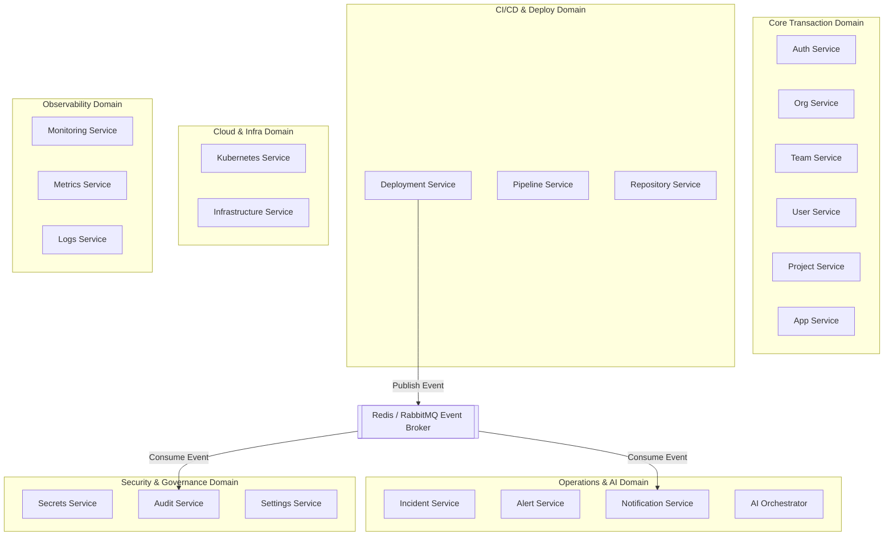

# OpsPilot AI: Phase 4 Enterprise Backend API Contract & Microservice Design

This document details the backend microservice boundaries, REST API specifications, real-time message structures, and integration webhook designs for **OpsPilot AI**—an Autonomous AI DevOps & Cloud Operations Platform.

---

## 1. Microservice Boundaries & Topology

OpsPilot AI is organized into distinct, decoupled services. Each microservice manages its own database tables and communicates with other services asynchronously via an event broker or synchronously using gRPC/Internal REST.



### 1.1 Microservice Specifications

#### 1. Authentication Service
* **Responsibility**: Authenticates users, issues JWTs, verifies MFA tokens, and manages API keys.
* **Dependencies**: User Service.
* **Events Published**: `auth.login_success`, `auth.mfa_failed`.
* **Events Consumed**: `user.deleted`.
* **Database Ownership**: Table: `Users`, `APIKeys` (Read/Write).
* **External Integrations**: OAuth Providers (Okta, Auth0, Google Workplace).

#### 2. Organization Service
* **Responsibility**: Manages billing tiers, tenants, and membership parameters.
* **Dependencies**: None.
* **Events Published**: `organization.created`, `organization.tier_updated`.
* **Events Consumed**: None.
* **Database Ownership**: Table: `Organizations`.
* **External Integrations**: Stripe (Billing).

#### 3. Team Service
* **Responsibility**: Manages user groupings within organizations for authorization checks.
* **Dependencies**: Organization Service, User Service.
* **Events Published**: `team.member_added`, `team.member_removed`.
* **Events Consumed**: `user.deleted`.
* **Database Ownership**: Table: `Teams`.
* **External Integrations**: None.

#### 4. User Service
* **Responsibility**: Manages user profiles, credentials, and settings.
* **Dependencies**: Organization Service.
* **Events Published**: `user.created`, `user.deleted`.
* **Events Consumed**: None.
* **Database Ownership**: Table: `Users`.
* **External Integrations**: SendGrid (Welcome emails).

#### 5. Project Service
* **Responsibility**: Groups applications, configurations, and repositories together.
* **Dependencies**: Team Service.
* **Events Published**: `project.created`, `project.archived`.
* **Events Consumed**: `team.deleted`.
* **Database Ownership**: Table: `Projects`.
* **External Integrations**: None.

#### 6. Application Service
* **Responsibility**: Configures target applications, types, and environment definitions.
* **Dependencies**: Project Service.
* **Events Published**: `application.created`, `application.modified`.
* **Events Consumed**: None.
* **Database Ownership**: Table: `Applications`, `Environments`.
* **External Integrations**: None.

#### 7. Deployment Service
* **Responsibility**: Executes Helm rollouts, handles release histories, and monitors Canary states.
* **Dependencies**: Application Service, Secrets Service, Kubernetes Service.
* **Events Published**: `deployment.started`, `deployment.completed`, `deployment.failed`.
* **Events Consumed**: `pipeline.run_success`.
* **Database Ownership**: Table: `Deployments`.
* **External Integrations**: ArgoCD, Helm.

#### 8. Pipeline Service
* **Responsibility**: Orchestrates CI/CD runner jobs and records step details.
* **Dependencies**: Repository Service, Secrets Service.
* **Events Published**: `pipeline.run_started`, `pipeline.run_success`, `pipeline.run_failed`.
* **Events Consumed**: `git.push_received`.
* **Database Ownership**: Table: `Pipelines`, `PipelineRuns`.
* **External Integrations**: Kubernetes runner engine (Karpenter nodes).

#### 9. Repository Service
* **Responsibility**: Connects code repositories, registers webhooks, and pulls repository contents.
* **Dependencies**: Project Service, Secrets Service.
* **Events Published**: `repository.connected`, `git.push_received`.
* **Events Consumed**: None.
* **Database Ownership**: Table: `Repositories`.
* **External Integrations**: GitHub, GitLab, Bitbucket.

#### 10. Kubernetes Service
* **Responsibility**: Integrates managed clusters and queries real-time resource data.
* **Dependencies**: Secrets Service.
* **Events Published**: `k8s.cluster_imported`, `k8s.pod_crashed`.
* **Events Consumed**: None.
* **Database Ownership**: Table: `Clusters`, `Pods`, `Services`.
* **External Integrations**: Kubernetes Cluster APIs (EKS, GKE, AKS).

#### 11. Infrastructure Service
* **Responsibility**: Triggers Terraform workflows to provision and update cloud resources.
* **Dependencies**: Secrets Service.
* **Events Published**: `infrastructure.plan_started`, `infrastructure.apply_completed`.
* **Events Consumed**: None.
* **Database Ownership**: Table: `Secrets` (infrastructure configs).
* **External Integrations**: AWS, GCP, Azure, Terraform Cloud.

#### 12. Monitoring Service
* **Responsibility**: Connects Grafana dashboards and updates scraping rules.
* **Dependencies**: Kubernetes Service.
* **Events Published**: `monitoring.target_discovered`.
* **Events Consumed**: `k8s.cluster_imported`.
* **Database Ownership**: None (Queries Prometheus API).
* **External Integrations**: Grafana API.

#### 13. Metrics Service
* **Responsibility**: Stores metric snapshots and executes health checking rules.
* **Dependencies**: None.
* **Events Published**: `metrics.threshold_exceeded`.
* **Events Consumed**: None.
* **Database Ownership**: Table: `Metrics` (relational rollups).
* **External Integrations**: Prometheus API.

#### 14. Logs Service
* **Responsibility**: Indexes and tails logs.
* **Dependencies**: Kubernetes Service.
* **Events Published**: `logs.error_pattern_detected`.
* **Events Consumed**: None.
* **Database Ownership**: Table: `Logs` (metadata indexes).
* **External Integrations**: Grafana Loki API.

#### 15. Incident Service
* **Responsibility**: Manages incident statuses and coordinates triage operations.
* **Dependencies**: Application Service, Alerts Service.
* **Events Published**: `incident.triggered`, `incident.acknowledged`, `incident.resolved`.
* **Events Consumed**: `alert.received`.
* **Database Ownership**: Table: `Incidents`.
* **External Integrations**: PagerDuty, Opsgenie.

#### 16. Alert Service
* **Responsibility**: Receives webhook payloads from Prometheus Alertmanager and routes alerts.
* **Dependencies**: None.
* **Events Published**: `alert.received`.
* **Events Consumed**: `metrics.threshold_exceeded`.
* **Database Ownership**: Table: `Alerts`.
* **External Integrations**: Prometheus Alertmanager.

#### 17. Notification Service
* **Responsibility**: Dispatches notifications across user-configured channels.
* **Dependencies**: User Service.
* **Events Published**: `notification.dispatched`.
* **Events Consumed**: `incident.triggered`, `deployment.failed`, `pipeline.run_failed`.
* **Database Ownership**: Table: `Notifications`.
* **External Integrations**: Slack API, Microsoft Teams, SendGrid.

#### 18. AI Orchestrator
* **Responsibility**: Runs multi-agent diagnostics, parses stack traces, and answers chat prompts.
* **Dependencies**: Kubernetes Service, Logs Service, Metrics Service, Incident Service.
* **Events Published**: `ai.analysis_completed`.
* **Events Consumed**: `incident.triggered`.
* **Database Ownership**: Table: `AIConversations`, Qdrant Vector Store.
* **External Integrations**: OpenAI, Anthropic, Gemini API.

#### 19. Secrets Service
* **Responsibility**: Stores configurations and manages KMS envelope encryption keys.
* **Dependencies**: None.
* **Events Published**: `secret.accessed`, `secret.rotated`.
* **Events Consumed**: None.
* **Database Ownership**: Table: `Secrets` (encrypted values).
* **External Integrations**: AWS KMS, HashiCorp Vault.

#### 20. Audit Service
* **Responsibility**: Logs actions to a secure, partitioned table.
* **Dependencies**: None.
* **Events Published**: None.
* **Events Consumed**: All system events (`auth.login_success`, `deployment.completed`, etc.).
* **Database Ownership**: Table: `AuditLogs`.
* **External Integrations**: Secure S3/WORM object stores.

#### 21. Settings Service
* **Responsibility**: Manages organization properties and system configurations.
* **Dependencies**: Organization Service.
* **Events Published**: `settings.updated`.
* **Events Consumed**: None.
* **Database Ownership**: Table: `Organizations` (config metadata fields).
* **External Integrations**: None.

---

## 2. Global Standards & Versioning

### 2.1 API Path Versioning
* All REST endpoints must use the version prefix `/api/v1/` (e.g., `/api/v1/projects`).
* **Deprecation Strategy**:
  - Deprecated routes return a `Deprecation: @<timestamp>` HTTP header.
  - Decommissioned routes return a `Sunset: <date>` HTTP header. After the sunset date, requests to these routes receive a `410 Gone` status code.
  - A fallback mock service handles older API structures to maintain backward compatibility during migrations.

### 2.2 Global Error Response Format (`RFC 7807`)
All API services return a unified error response payload structure on error states:

```json
{
  "error_code": "RESOURCE_NOT_FOUND",
  "message": "The requested application was not found in this environment.",
  "details": [
    {
      "field": "application_id",
      "issue": "UUID format is invalid or entity does not exist."
    }
  ],
  "trace_id": "err_5f8d9b62a4cf4b2",
  "timestamp": "2026-07-10T21:00:58Z"
}
```

---

## 3. REST API Endpoint Specifications

### 3.1 Authentication: Login Endpoint
* **Method**: `POST`
* **Route**: `/api/v1/auth/login`
* **Purpose**: Authenticate user credentials and return an access token.
* **Authentication Required**: No.
* **Roles Allowed**: Public.
* **Request Schema**:
  ```json
  {
    "email": "user@organization.com",
    "password": "PasswordPlaintextString"
  }
  ```
* **Response Schema (200 OK)**:
  ```json
  {
    "access_token": "eyJhbGciOiJIUzI1NiIsIn...",
    "token_type": "Bearer",
    "expires_in": 900,
    "mfa_required": false
  }
  ```
* **Validation Rules**:
  - `email` must be a valid email format.
  - `password` must be non-empty (minimum 8 characters).
* **Possible Error Responses**:
  - `401 Unauthorized`: Invalid credentials (`error_code: "INVALID_CREDENTIALS"`).
  - `429 Too Many Requests`: Triggered after 5 failed login attempts (`error_code: "RATE_LIMIT_EXCEEDED"`).
* **Rate Limits**: 10 requests per minute per IP address.
* **Idempotency**: Not applicable.

---

### 3.2 Kubernetes: Fetch Cluster Pods
* **Method**: `GET`
* **Route**: `/api/v1/clusters/{cluster_id}/pods`
* **Purpose**: Retrieve a list of pods in a cluster with optional namespace filtering.
* **Authentication Required**: Yes.
* **Roles Allowed**: `OrgOwner`, `PlatformAdmin`, `DevOpsEngineer`, `Developer`, `ReadOnly`.
* **Request Parameters (Query)**:
  * `namespace` (String, Optional) - Filter by namespace.
  * `status` (String, Optional) - Filter by state (e.g., `'Running'`, `'CrashLoopBackOff'`).
  * `page` (Integer, Default: 1) - Page number.
  * `limit` (Integer, Default: 50, Max: 250) - Records per page.
  * `sort_by` (String, Default: `'name'`) - Sort field.
  * `sort_order` (String, Default: `'asc'`) - Sort direction (`'asc'` or `'desc'`).
* **Response Schema (200 OK)**:
  ```json
  {
    "data": [
      {
        "id": "848b8137-0cfc-4977-84bc-87c2f82c40c8",
        "name": "payment-v1-abc",
        "namespace": "payment",
        "status": "Running",
        "restarts": 0,
        "cpu_usage": 0.12,
        "memory_usage": 268435456,
        "ip_address": "10.244.1.45"
      }
    ],
    "pagination": {
      "total_records": 1,
      "total_pages": 1,
      "current_page": 1,
      "limit": 50
    }
  }
  ```
* **Validation Rules**:
  - `cluster_id` must be a valid UUID.
* **Possible Error Responses**:
  - `404 Not Found`: Cluster not found (`error_code: "CLUSTER_NOT_FOUND"`).
  - `401 Unauthorized`: Missing or invalid Bearer token.
  - `403 Forbidden`: User does not have access to the cluster's organization.
* **Rate Limits**: 500 requests per minute per user token.

---

### 3.3 Deployments: Deploy Application
* **Method**: `POST`
* **Route**: `/api/v1/environments/{environment_id}/deploy`
* **Purpose**: Trigger a new deployment run in the target environment.
* **Authentication Required**: Yes.
* **Roles Allowed**: `OrgOwner`, `PlatformAdmin`, `DevOpsEngineer`.
* **Headers**: `Idempotency-Key` (UUID, Required).
* **Request Schema**:
  ```json
  {
    "commit_sha": "d6e8b4e7a2cf4910e53a290bcda61a86a67f082c",
    "image_tag": "v1.5.0-release",
    "helm_values_override": {
      "replicaCount": 3,
      "resources": {
        "limits": {
          "cpu": "500m"
        }
      }
    }
  }
  ```
* **Response Schema (201 Created)**:
  ```json
  {
    "deployment_id": "fa6bcf89-8d19-482a-a92c-ff8c18dae1c2",
    "status": "pending",
    "environment_id": "748b8137-0cfc-4977-84bc-87c2f82c40c8",
    "created_at": "2026-07-10T21:00:58Z"
  }
  ```
* **Validation Rules**:
  - `commit_sha` must be exactly 40 hexadecimal characters.
* **Possible Error Responses**:
  - `409 Conflict`: A deployment is already running in this environment (`error_code: "DEPLOYMENT_CONFLICT"`).
  - `422 Unprocessable`: Invalid Helm values JSON format.
* **Rate Limits**: 30 requests per minute per user token.
* **Idempotency**: Returns the existing deployment record if the same `Idempotency-Key` is reused within 24 hours.

---

## 4. Real-Time Event APIs

OpsPilot AI provides real-time event updates over WebSockets. Clients connect to a unified gateway path and subscribe to specific event streams.

### 4.1 Connection Gateway
* **WebSocket Path**: `/api/v1/ws/stream`
* **Authentication**: Token passed as a query parameter (e.g., `/api/v1/ws/stream?token=eyJhbG...`).

### 4.2 Subscription Message Format (Client to Server)
```json
{
  "action": "subscribe",
  "topic": "deployments:fa6bcf89-8d19-482a-a92c-ff8c18dae1c2"
}
```

### 4.3 Outbound Event Format (Server to Client)
All real-time events use a standard envelope structure:

```json
{
  "topic": "deployments:fa6bcf89-8d19-482a-a92c-ff8c18dae1c2",
  "event": "deployment.progress",
  "payload": {
    "status": "rolling_out",
    "percent_complete": 66,
    "active_replicas": 2,
    "desired_replicas": 3,
    "timestamp": "2026-07-10T21:03:00Z"
  }
}
```

### 4.4 Supported Topics
* `pipelines:{run_id}` -> Emits step results and console outputs (`pipeline.step_output`).
* `logs:pods:{pod_id}` -> Streams container output logs (`pod.log_line`).
* `metrics:pods:{pod_id}` -> Streams real-time resource usage data (`pod.metrics_tick`).
* `incidents:active` -> Broadcasts new alerts and incident status updates.
* `ai:conversations:{conv_id}` -> Streams tokens for conversational responses.

---

## 5. Webhook Integration Contracts

### 5.1 Incoming VCS Webhook: GitHub Push Event
* **Receiver Path**: `POST /api/v1/webhooks/github`
* **Signature Header**: `X-Hub-Signature-256` (HMAC-SHA256 hex digest validated using the registered webhook secret).
* **Payload**:
  ```json
  {
    "ref": "refs/heads/main",
    "before": "bef01a86a67f082cd6e8b4e7a2cf4910e53a290b",
    "after": "d6e8b4e7a2cf4910e53a290bcda61a86a67f082c",
    "repository": {
      "name": "payment-gateway",
      "clone_url": "https://github.com/org/payment-gateway.git"
    },
    "pusher": {
      "name": "devops-engineer",
      "email": "devops@org.com"
    }
  }
  ```

### 5.2 Outgoing Event Webhook: Deployment Failed
* **Destination**: External user endpoint (e.g., Slack integration server).
* **Signature Header**: `X-OpsPilot-Signature-256` (HMAC-SHA256 digest).
* **Payload**:
  ```json
  {
    "event_id": "evt_7d8e12b4f51e443a",
    "event_type": "deployment.failed",
    "timestamp": "2026-07-10T21:04:12Z",
    "data": {
      "deployment_id": "fa6bcf89-8d19-482a-a92c-ff8c18dae1c2",
      "environment_name": "production",
      "application_name": "payment-api",
      "failure_reason": "CrashLoopBackOff detected in replica set: payment-v1-abc",
      "logs_excerpt": "FATAL: connection limit exceeded for database connection pool."
    }
  }
  ```
