# OpsPilot AI: Phase 1 Enterprise Product Foundation & Architecture Blueprint

This blueprint outlines the production-grade, multi-tenant enterprise system design, database architecture, multi-agent AI framework, security architecture, and observability stack for **OpsPilot AI**—an Autonomous AI DevOps & Cloud Operations Platform.

---

## 1. Modular System & Service-Oriented Architecture

OpsPilot AI is structured as a modular, service-oriented architecture (SOA) to guarantee high availability, fault isolation, and independent scalability of front-end, transactional, computational, and intelligence components.

### 1.1 Architectural Block Diagram

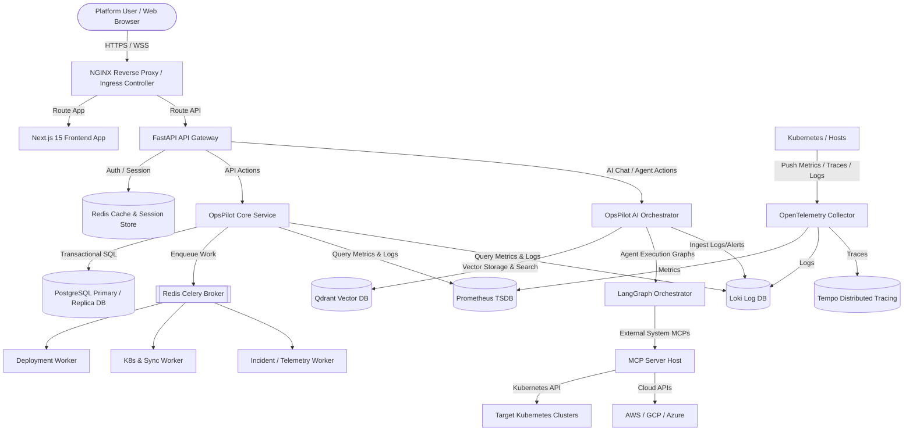

### 1.2 Architectural Component Breakdown

#### A. Frontend Tier (Next.js 15, React 19, TypeScript)
* **Design Rationale**: SSR (Server-Side Rendering) for static control panels (settings, documentation) and SPA (Single Page Application) behavior for high-frequency updates (real-time logs, live Kubernetes terminal dashboards, and agent chats).
* **State Management**: **Zustand** controls micro-client-side interface states (sidebar positions, terminal tab selections, chat session context). **TanStack Query** manages server-side cache synchronization, polling intervals, and optimistic updates.
* **Component Layer**: Customized **ShadCN UI** widgets built on top of Tailwind CSS utilities, offering accessible (WAI-ARIA compliant), responsive layouts.

#### B. API Gateway & Core Backend Tier (FastAPI, Python)
* **Design Rationale**: FastAPI leverages Python's asynchronous (`async`/`await`) features to process thousands of concurrent connections with low memory usage. It acts as the HTTP interface for transactional APIs and hosts WebSocket servers for real-time log streaming, Kubernetes pod updates, and interactive AI agent chats.
* **Service Segregation**: Core operational requests (creating a project, deploying a pipeline, viewing incident status) are sent to the core transactional backend. AI, metrics analysis, and log parsing queries are routed directly to the AI service layer.

#### C. Background Task Tier (Celery, Redis)
* **Design Rationale**: Time-consuming actions (Docker builds, Terraform runs, Helm chart installations, cluster imports) must not block the core API event loop. Celery background workers run as isolated pods that process tasks asynchronously.
* **Broker & Backend**: Redis acts as a high-speed message broker and task result store.

#### D. Intelligent Agent Tier (LangGraph, MCP, Qdrant)
* **Design Rationale**: AI actions require complex, non-linear reasoning loops (e.g., retrieving a log -> parsing the error -> querying Kubernetes API -> testing a resolution -> writing a post-mortem). **LangGraph** provides cyclic graph orchestration for multi-agent workflows.
* **Model Context Protocol (MCP)**: Custom MCP servers host tools that securely interact with local systems, Kubernetes APIs, and cloud provider SDKs, separating LLM prompt assembly from tool execution.
* **Vector Memory (Qdrant)**: Houses incident post-mortems, cluster setup documentation, runs historical search embeddings, and executes RAG (Retrieval-Augmented Generation) queries.

---

## 2. Database Design (Entity-Relationship & Data Models)

OpsPilot AI relies on a hybrid data architecture. **PostgreSQL** handles relational operational models, relational entities, configuration profiles, and transactional data. **Qdrant** manages vector records for chat memory and logs. **Prometheus/Loki/Tempo** handle time-series logs and metrics.

Below is the design of the PostgreSQL transactional relational database schema, detailed through entity attributes, data types, indexing strategies, and relationships.

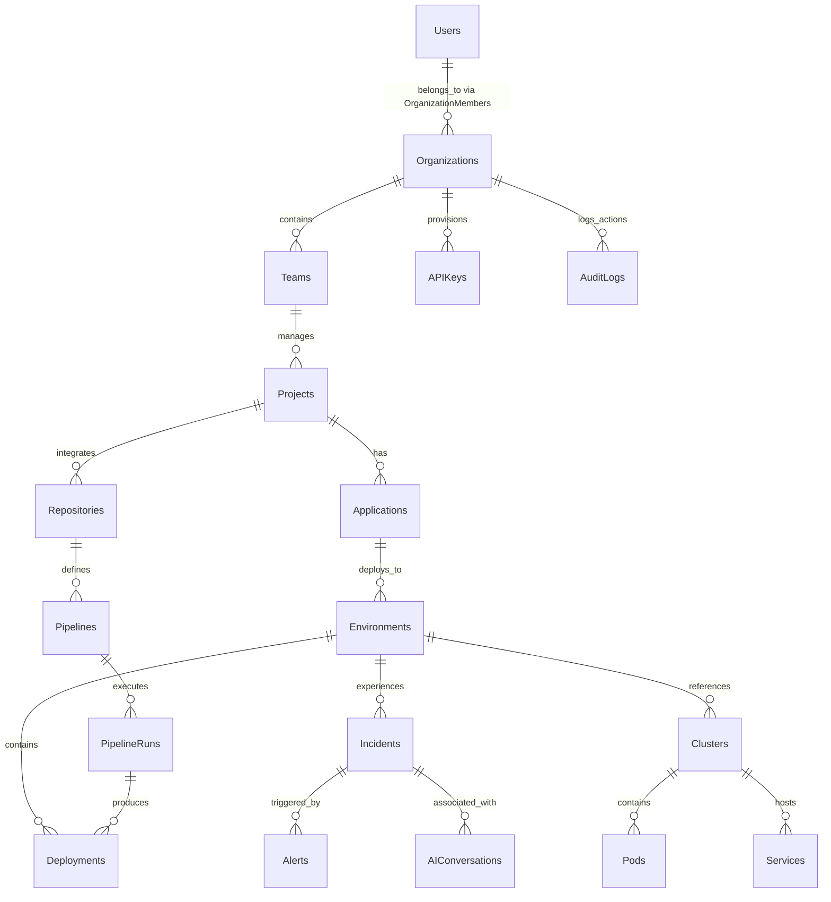

### 2.1 Entity Model Specifications

#### 1. Users
* **Purpose**: Represents platform users, administrators, developers, and platform engineers.
* **Attributes**:
  * `id` (`UUID`, Primary Key, Defaults to `gen_random_uuid()`)
  * `email` (`VARCHAR(255)`, Unique, Indexed for quick lookup)
  * `password_hash` (`VARCHAR(255)`)
  * `full_name` (`VARCHAR(128)`)
  * `is_active` (`BOOLEAN`, Default: `true`)
  * `mfa_secret` (`VARCHAR(128)`, Nullable)
  * `created_at` (`TIMESTAMP WITH TIME ZONE`, Default: `NOW()`)
  * `updated_at` (`TIMESTAMP WITH TIME ZONE`, Default: `NOW()`)
* **Relationships**:
  * Many-to-Many with **Organizations** via `OrganizationMembers`
* **Indexing Strategy**: B-Tree index on `email` (case-insensitive indexing).

#### 2. Organizations
* **Purpose**: Logical tenant boundary. All data, billing, and permissions are isolated at the organization level.
* **Attributes**:
  * `id` (`UUID`, Primary Key)
  * `name` (`VARCHAR(128)`, Unique)
  * `slug` (`VARCHAR(128)`, Unique, Indexed)
  * `billing_tier` (`VARCHAR(32)`, Default: `'free'`)
  * `created_at` (`TIMESTAMP WITH TIME ZONE`, Default: `NOW()`)
  * `updated_at` (`TIMESTAMP WITH TIME ZONE`, Default: `NOW()`)
* **Relationships**:
  * One-to-Many with **Teams**, **APIKeys**, **AuditLogs**
* **Indexing Strategy**: B-Tree index on `slug` for clean URL routing.

#### 3. Teams
* **Purpose**: Sub-tenancy unit inside an organization for group-based access control.
* **Attributes**:
  * `id` (`UUID`, Primary Key)
  * `organization_id` (`UUID`, Foreign Key pointing to `Organizations(id)`, On Delete Cascade)
  * `name` (`VARCHAR(128)`)
  * `slug` (`VARCHAR(128)`, Indexed)
  * `description` (`TEXT`)
  * `created_at` (`TIMESTAMP WITH TIME ZONE`, Default: `NOW()`)
* **Relationships**:
  * Many-to-Many with **Users** via `TeamMembers`
  * One-to-Many with **Projects**
* **Indexing Strategy**: Composite B-Tree index on `(organization_id, slug)`.

#### 4. Projects
* **Purpose**: A grouping of related services, repositories, pipelines, and infrastructure.
* **Attributes**:
  * `id` (`UUID`, Primary Key)
  * `team_id` (`UUID`, Foreign Key pointing to `Teams(id)`, On Delete Cascade)
  * `name` (`VARCHAR(128)`)
  * `slug` (`VARCHAR(128)`, Indexed)
  * `created_at` (`TIMESTAMP WITH TIME ZONE`, Default: `NOW()`)
* **Relationships**:
  * One-to-Many with **Applications**, **Repositories**
* **Indexing Strategy**: Composite B-Tree index on `(team_id, slug)`.

#### 5. Applications
* **Purpose**: Microservices or applications deployed through the platform.
* **Attributes**:
  * `id` (`UUID`, Primary Key)
  * `project_id` (`UUID`, Foreign Key pointing to `Projects(id)`, On Delete Cascade)
  * `name` (`VARCHAR(128)`)
  * `slug` (`VARCHAR(128)`)
  * `app_type` (`VARCHAR(32)`) (e.g., `'web'`, `'worker'`, `'cron'`)
  * `created_at` (`TIMESTAMP WITH TIME ZONE`, Default: `NOW()`)
* **Relationships**:
  * One-to-Many with **Environments**
* **Indexing Strategy**: B-Tree index on `(project_id, slug)`.

#### 6. Environments
* **Purpose**: Isolated stages for an application, e.g., dev, staging, production.
* **Attributes**:
  * `id` (`UUID`, Primary Key)
  * `application_id` (`UUID`, Foreign Key pointing to `Applications(id)`, On Delete Cascade)
  * `name` (`VARCHAR(64)`) (e.g., `'production'`)
  * `env_vars` (`JSONB`, Encrypted field for environment variables)
  * `cluster_id` (`UUID`, Foreign Key pointing to `Clusters(id)`, Nullable)
  * `namespace` (`VARCHAR(63)`) (Target Kubernetes namespace)
  * `created_at` (`TIMESTAMP WITH TIME ZONE`, Default: `NOW()`)
* **Relationships**:
  * One-to-Many with **Deployments**, **Incidents**
  * Many-to-One with **Clusters**
* **Indexing Strategy**: Unique index on `(application_id, name)`.

#### 7. Deployments
* **Purpose**: Records instance-level updates of applications in specific environments.
* **Attributes**:
  * `id` (`UUID`, Primary Key)
  * `environment_id` (`UUID`, Foreign Key pointing to `Environments(id)`)
  * `pipeline_run_id` (`UUID`, Foreign Key pointing to `PipelineRuns(id)`, Nullable)
  * `commit_sha` (`VARCHAR(40)`, Indexed)
  * `image_tag` (`VARCHAR(128)`)
  * `status` (`VARCHAR(32)`) (e.g., `'pending'`, `'deploying'`, `'success'`, `'failed'`, `'rolled_back'`)
  * `helm_release_version` (`INTEGER`)
  * `deployed_by` (`UUID`, Foreign Key pointing to `Users(id)`)
  * `created_at` (`TIMESTAMP WITH TIME ZONE`, Default: `NOW()`)
  * `completed_at` (`TIMESTAMP WITH TIME ZONE`, Nullable)
* **Relationships**:
  * Many-to-One with **Environments**, **PipelineRuns**, **Users**
* **Indexing Strategy**: B-Tree index on `environment_id` and composite index on `(status, created_at DESC)`.

#### 8. Pipelines
* **Purpose**: CI/CD automation schemas.
* **Attributes**:
  * `id` (`UUID`, Primary Key)
  * `repository_id` (`UUID`, Foreign Key pointing to `Repositories(id)`)
  * `name` (`VARCHAR(128)`)
  * `definition_path` (`VARCHAR(255)`) (e.g., `'.opspilot/pipeline.yaml'`)
  * `is_active` (`BOOLEAN`, Default: `true`)
  * `created_at` (`TIMESTAMP WITH TIME ZONE`, Default: `NOW()`)
* **Relationships**:
  * One-to-Many with **PipelineRuns**
  * Many-to-One with **Repositories**

#### 9. Pipeline Runs
* **Purpose**: Execution instances of defined Pipelines.
* **Attributes**:
  * `id` (`UUID`, Primary Key)
  * `pipeline_id` (`UUID`, Foreign Key pointing to `Pipelines(id)`, On Delete Cascade)
  * `trigger_event` (`VARCHAR(64)`) (e.g., `'webhook'`, `'manual'`, `'scheduled'`)
  * `branch` (`VARCHAR(256)`)
  * `commit_sha` (`VARCHAR(40)`)
  * `status` (`VARCHAR(32)`) (e.g., `'running'`, `'success'`, `'failed'`, `'cancelled'`)
  * `log_url` (`VARCHAR(512)`)
  * `duration_seconds` (`INTEGER`, Nullable)
  * `started_at` (`TIMESTAMP WITH TIME ZONE`, Default: `NOW()`)
  * `finished_at` (`TIMESTAMP WITH TIME ZONE`, Nullable)
* **Relationships**:
  * Many-to-One with **Pipelines**
  * One-to-Many with **Deployments**
* **Indexing Strategy**: B-Tree index on `(pipeline_id, status, started_at DESC)`.

#### 10. Repositories
* **Purpose**: VCS configuration metadata.
* **Attributes**:
  * `id` (`UUID`, Primary Key)
  * `project_id` (`UUID`, Foreign Key pointing to `Projects(id)`, On Delete Cascade)
  * `provider` (`VARCHAR(32)`) (e.g., `'github'`, `'gitlab'`)
  * `repo_url` (`VARCHAR(512)`)
  * `auth_token_encrypted` (`BYTEA`)
  * `webhook_secret` (`VARCHAR(128)`)
  * `default_branch` (`VARCHAR(128)`)
  * `created_at` (`TIMESTAMP WITH TIME ZONE`, Default: `NOW()`)
* **Relationships**:
  * Many-to-One with **Projects**
  * One-to-Many with **Pipelines**

#### 11. Clusters
* **Purpose**: Target Kubernetes clusters registered under management.
* **Attributes**:
  * `id` (`UUID`, Primary Key)
  * `organization_id` (`UUID`, Foreign Key pointing to `Organizations(id)`)
  * `name` (`VARCHAR(128)`)
  * `provider` (`VARCHAR(32)`) (e.g., `'eks'`, `'gke'`, `'aks'`, `'baremetal'`)
  * `kubeconfig_encrypted` (`BYTEA`)
  * `status` (`VARCHAR(32)`) (e.g., `'healthy'`, `'unreachable'`, `'degraded'`)
  * `version` (`VARCHAR(32)`)
  * `created_at` (`TIMESTAMP WITH TIME ZONE`, Default: `NOW()`)
* **Relationships**:
  * One-to-Many with **Pods**, **Services**, **Environments**
* **Indexing Strategy**: B-Tree index on `(organization_id, status)`.

#### 12. Pods
* **Purpose**: Discovered Kubernetes Pod entities synced in real-time.
* **Attributes**:
  * `id` (`UUID`, Primary Key)
  * `cluster_id` (`UUID`, Foreign Key pointing to `Clusters(id)`, On Delete Cascade)
  * `namespace` (`VARCHAR(63)`)
  * `name` (`VARCHAR(253)`)
  * `status` (`VARCHAR(32)`) (e.g., `'Running'`, `'Pending'`, `'CrashLoopBackOff'`, `'Failed'`)
  * `ip_address` (`INET`)
  * `cpu_usage_cores` (`DOUBLE PRECISION`, Nullable)
  * `memory_usage_bytes` (`BIGINT`, Nullable)
  * `restarts` (`INTEGER`, Default: 0)
  * `synced_at` (`TIMESTAMP WITH TIME ZONE`, Default: `NOW()`)
* **Relationships**:
  * Many-to-One with **Clusters**
* **Indexing Strategy**: Composite index on `(cluster_id, namespace, name)` (Unique).

#### 13. Services
* **Purpose**: Discovered Kubernetes Services (ClusterIP, NodePort, LoadBalancer).
* **Attributes**:
  * `id` (`UUID`, Primary Key)
  * `cluster_id` (`UUID`, Foreign Key pointing to `Clusters(id)`, On Delete Cascade)
  * `namespace` (`VARCHAR(63)`)
  * `name` (`VARCHAR(253)`)
  * `service_type` (`VARCHAR(32)`)
  * `cluster_ip` (`INET`)
  * `external_ip` (`VARCHAR(256)`, Nullable)
  * `ports` (`JSONB`)
  * `synced_at` (`TIMESTAMP WITH TIME ZONE`, Default: `NOW()`)
* **Relationships**:
  * Many-to-One with **Clusters**

#### 14. Metrics (Relational Rollups / Time-series Cache)
* **Purpose**: Fast system lookup for high-level health trends (raw metrics live in Prometheus).
* **Attributes**:
  * `id` (`BIGSERIAL`, Primary Key)
  * `target_id` (`UUID`, Indexed) (maps to a pod, service, cluster, or deployment)
  * `metric_name` (`VARCHAR(128)`, Indexed)
  * `value` (`DOUBLE PRECISION`)
  * `timestamp` (`TIMESTAMP WITH TIME ZONE`, Default: `NOW()`)
* **Partitioning**: Partitioned by month (`timestamp`) in Postgres to facilitate efficient rollups, though Prometheus remains primary.

#### 15. Logs (Metadata Indexes)
* **Purpose**: Houses indexing points, annotations, and metadata linking files to Prometheus/Loki timestamps.
* **Attributes**:
  * `id` (`BIGSERIAL`, Primary Key)
  * `pod_id` (`UUID`, Foreign Key pointing to `Pods(id)`)
  * `severity` (`VARCHAR(16)`, Indexed) (e.g., `'INFO'`, `'ERROR'`)
  * `loki_query_params` (`JSONB`)
  * `timestamp` (`TIMESTAMP WITH TIME ZONE`)
* **Indexing Strategy**: Partitioned by time.

#### 16. Incidents
* **Purpose**: Track platform operational outages, failures, or alerts.
* **Attributes**:
  * `id` (`UUID`, Primary Key)
  * `environment_id` (`UUID`, Foreign Key pointing to `Environments(id)`)
  * `title` (`VARCHAR(256)`)
  * `severity` (`VARCHAR(16)`) (e.g., `'P0'`, `'P1'`, `'P2'`)
  * `status` (`VARCHAR(32)`) (e.g., `'triggered'`, `'acknowledged'`, `'resolved'`)
  * `acknowledged_by` (`UUID`, Foreign Key pointing to `Users(id)`, Nullable)
  * `root_cause_analysis` (`TEXT`, Nullable)
  * `resolved_at` (`TIMESTAMP WITH TIME ZONE`, Nullable)
  * `created_at` (`TIMESTAMP WITH TIME ZONE`, Default: `NOW()`)
* **Relationships**:
  * One-to-Many with **Alerts**, **AIConversations**
* **Indexing Strategy**: B-Tree index on `(status, severity)` and `environment_id`.

#### 17. Alerts
* **Purpose**: Alerts triggered by Prometheus/Loki Alertmanager that tie into Incidents.
* **Attributes**:
  * `id` (`UUID`, Primary Key)
  * `incident_id` (`UUID`, Foreign Key pointing to `Incidents(id)`, Nullable)
  * `alertname` (`VARCHAR(128)`)
  * `source` (`VARCHAR(64)`) (e.g., `'prometheus'`)
  * `labels` (`JSONB`)
  * `annotations` (`JSONB`)
  * `starts_at` (`TIMESTAMP WITH TIME ZONE`)
  * `ends_at` (`TIMESTAMP WITH TIME ZONE`, Nullable)
* **Relationships**:
  * Many-to-One with **Incidents**

#### 18. Notifications
* **Purpose**: Dispatched notifications to users or integration endpoints (Slack, Teams, PagerDuty, Webhooks).
* **Attributes**:
  * `id` (`UUID`, Primary Key)
  * `user_id` (`UUID`, Foreign Key pointing to `Users(id)`, Nullable) (null if team/org notification)
  * `org_id` (`UUID`, Foreign Key pointing to `Organizations(id)`)
  * `channel` (`VARCHAR(32)`) (e.g., `'slack'`, `'email'`, `'in_app'`)
  * `title` (`VARCHAR(256)`)
  * `body` (`TEXT`)
  * `status` (`VARCHAR(32)`) (e.g., `'queued'`, `'sent'`, `'failed'`)
  * `created_at` (`TIMESTAMP WITH TIME ZONE`, Default: `NOW()`)
* **Indexing Strategy**: B-Tree index on `(org_id, status)`.

#### 19. Audit Logs
* **Purpose**: Immutable log of platform events for security and compliance audits.
* **Attributes**:
  * `id` (`BIGSERIAL`, Primary Key)
  * `organization_id` (`UUID`, Foreign Key pointing to `Organizations(id)`)
  * `user_id` (`UUID`, Foreign Key pointing to `Users(id)`, Nullable)
  * `action` (`VARCHAR(128)`) (e.g., `'user.login'`, `'secret.create'`, `'deployment.start'`)
  * `ip_address` (`INET`)
  * `user_agent` (`VARCHAR(512)`)
  * `payload` (`JSONB`) (Snapshot of mutated objects)
  * `created_at` (`TIMESTAMP WITH TIME ZONE`, Default: `NOW()`)
* **Partitioning**: Partitioned monthly by `created_at`.
* **Indexing Strategy**: B-Tree index on `(organization_id, created_at DESC)`.

#### 20. AI Conversations
* **Purpose**: Persistent records of chats with operations agents.
* **Attributes**:
  * `id` (`UUID`, Primary Key)
  * `user_id` (`UUID`, Foreign Key pointing to `Users(id)`)
  * `incident_id` (`UUID`, Foreign Key pointing to `Incidents(id)`, Nullable)
  * `title` (`VARCHAR(256)`)
  * `messages` (`JSONB`) (Structured array of messages: role, content, tool_calls, timestamp)
  * `created_at` (`TIMESTAMP WITH TIME ZONE`, Default: `NOW()`)
  * `updated_at` (`TIMESTAMP WITH TIME ZONE`, Default: `NOW()`)
* **Relationships**:
  * Many-to-One with **Users**, **Incidents**
* **Indexing Strategy**: B-Tree index on `(user_id, updated_at DESC)`.

#### 21. Secrets
* **Purpose**: Highly secure vault storage references (relies on DB encryption/KMS).
* **Attributes**:
  * `id` (`UUID`, Primary Key)
  * `organization_id` (`UUID`, Foreign Key pointing to `Organizations(id)`, On Delete Cascade)
  * `key` (`VARCHAR(128)`)
  * `encrypted_value` (`BYTEA`) (Encrypted via Envelope AES-GCM-256)
  * `kms_key_version` (`VARCHAR(64)`)
  * `created_at` (`TIMESTAMP WITH TIME ZONE`, Default: `NOW()`)
* **Indexing Strategy**: Unique index on `(organization_id, key)`.

#### 22. API Keys
* **Purpose**: Machine-to-machine authentication tokens.
* **Attributes**:
  * `id` (`UUID`, Primary Key)
  * `organization_id` (`UUID`, Foreign Key pointing to `Organizations(id)`, On Delete Cascade)
  * `name` (`VARCHAR(64)`)
  * `prefix` (`VARCHAR(8)`) (First 8 characters of key for identification)
  * `hash` (`VARCHAR(64)`) (SHA-256 hash of API key)
  * `scopes` (`VARCHAR(64)[]`) (Array of permitted RBAC scopes)
  * `expires_at` (`TIMESTAMP WITH TIME ZONE`, Nullable)
  * `created_at` (`TIMESTAMP WITH TIME ZONE`, Default: `NOW()`)
* **Indexing Strategy**: B-Tree index on `hash` (unique) to permit instantaneous lookups.

---

## 3. System Design & Core Workflows

### 3.1 Authentication & RBAC Flow

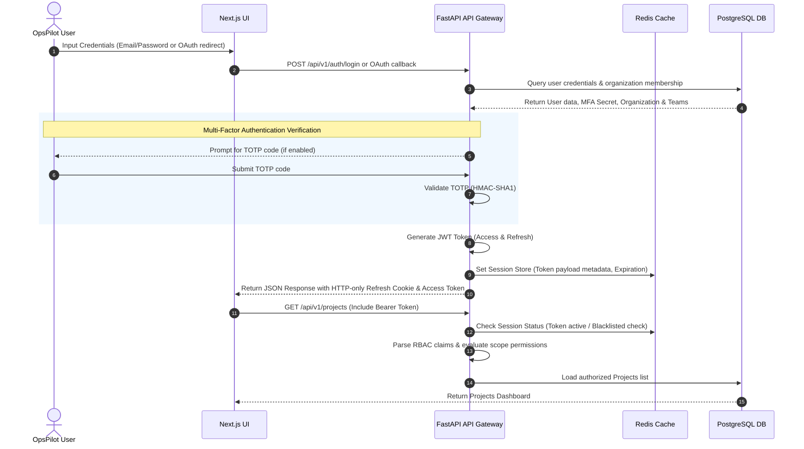

### 3.2 Automated Deployment Pipeline Flow

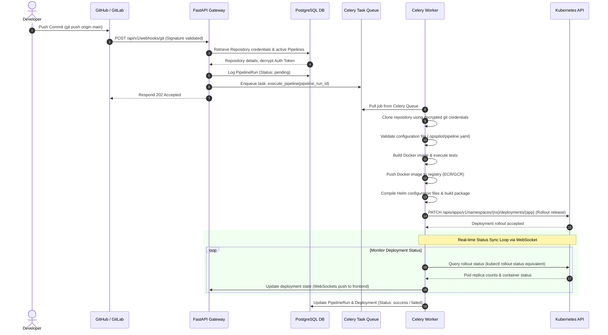

### 3.3 Alerting, Incident Management & Auto-Triage Flow

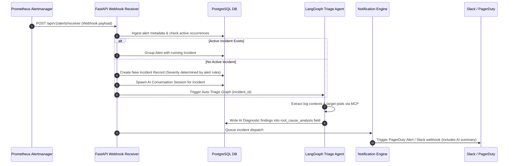

### 3.4 Telemetry Collection & Monitoring Flow

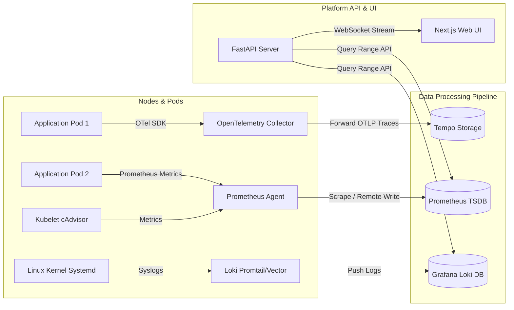

### 3.5 AI Diagnosis & Root Cause Analysis (RCA) Flow

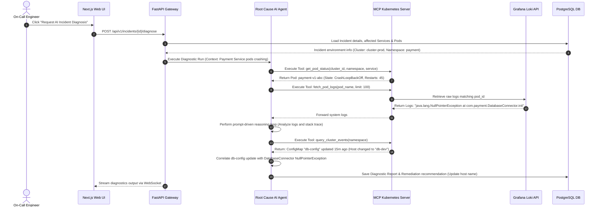

### 3.6 Log Processing Pipeline Flow

```mermaid
graph TD
    AppPods[Application Containers] -->|Stdout/Stderr| K8sLogs[/var/log/containers/*.log]
    K8sLogs --> Vector[Vector DaemonSet Agent]
    
    subgraph Data Enrichment & Route
        Vector -->|Read & Parse JSON| Parse[Metadata Injection Node]
        Parse -->|Attach: cluster_id, pod_name, namespace_id| Filter[Log Filtering/Drop Rules]
        Filter -->|Exclude debug noise| Batch[Log Batching & Compression Engine]
    end
    
    Batch -->|HTTP Push| Loki[Grafana Loki]
    Loki -->|Index Metadata| LokiDB[(Object Storage - S3/MinIO)]
    
    Gateway[FastAPI Web Server] -->|Live Log Tail Query| Loki
    Gateway -->|Stream Logs| FE[Web Browser WebSocket]
```

### 3.7 Pipeline Execution Engine Workflow

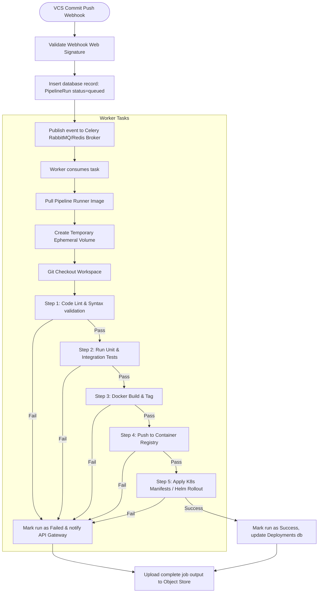

### 3.8 Notification Dispatch Flow

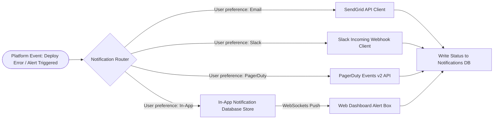

---

## 4. AI Multi-Agent & Orchestration Layer

OpsPilot AI models its operations center as a multi-agent system built on **LangGraph**. The platform splits operational domains into distinct agents to manage complexity, define clean boundaries, and support specialized tooling.

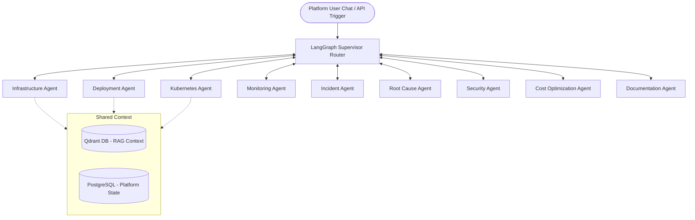

### 4.1 Specialized Agent Profiles

#### 1. Infrastructure Agent
* **Responsibilities**: Analyze Terraform directories, identify plan mutations, generate configuration blocks, and diagnose provider provisioning failures.
* **Inputs**: Terraform config code files, raw output from Terraform plan execution, AWS/GCP resource IDs.
* **Outputs**: Suggested Terraform code fixes, structured breakdown of planned resource modifications.
* **Tools**: `terraform_fmt`, `terraform_validate`, `get_aws_resource_status`, `simulate_terraform_run`.
* **Memory**: Local thread history, persistent index of historical execution runs.

#### 2. Deployment Agent
* **Responsibilities**: Analyze deployment manifests, guide Helm releases, debug rollout blockages, and offer automated canary rollback recommendations.
* **Inputs**: Helm charts, Kubernetes deployment manifest YAML, pipeline history logs, image tags.
* **Outputs**: Rollback trigger scripts, modified deployment settings, container version upgrades.
* **Tools**: `helm_list`, `helm_history`, `helm_rollback`, `get_deployment_rollout_status`.
* **Memory**: Short-term execution log cache, long-term success metrics of historic deployments.

#### 3. Kubernetes Agent
* **Responsibilities**: Inspect cluster nodes, read resource descriptions, tail container logs, run diagnostics, and debug cluster health issues.
* **Inputs**: Namespace configs, resource manifests, pod description reports, events.
* **Outputs**: Live configuration recommendations, interactive patch definitions.
* **Tools**: `kubectl_get_pods`, `kubectl_describe_resource`, `kubectl_get_events`, `kubectl_exec_diagnostic`.
* **Memory**: Active cluster node configuration map, thread-specific operational sequence history.

#### 4. Monitoring Agent
* **Responsibilities**: Query Prometheus, format metric charts, evaluate alerting thresholds, and identify anomalous resource consumption trends.
* **Inputs**: PromQL query results, alert states, threshold configs, scrape targets.
* **Outputs**: Custom PromQL query configurations, diagnostic suggestions for alert thresholds.
* **Tools**: `query_prometheus_instant`, `query_prometheus_range`, `get_active_alerts`, `suggest_metric_thresholds`.
* **Memory**: Historical query configurations, patterns of metric spikes.

#### 5. Incident Response Agent
* **Responsibilities**: Triage incoming alert storms, run validation scripts, coordinate resolution tasks, and record incident steps.
* **Inputs**: Webhook payloads, pager schedules, active incident database records, current system status alerts.
* **Outputs**: Diagnostic step records, proposed runbook commands.
* **Tools**: `get_incident_history`, `pagerduty_trigger_event`, `ack_active_incident`, `post_incident_runbook`.
* **Memory**: Structured sequence of incident events, resolution notes.

#### 6. Root Cause Agent
* **Responsibilities**: Review error logs, correlate database events, isolate deployment changes, and draft incident post-mortems.
* **Inputs**: Multi-system error stack traces, Loki log history, git commit differences.
* **Outputs**: Incident post-mortem documents, remediation plans.
* **Tools**: `search_vector_database_incidents`, `get_git_diff`, `analyze_stack_trace`, `query_loki_logs`.
* **Memory**: Vector database containing historic incident records and resolution strategies.

#### 7. Security Agent
* **Responsibilities**: Scan container images, audit RBAC permissions, review infrastructure configurations, and identify potential exposures.
* **Inputs**: Container vulnerability report lists, IAM role definitions, API configuration options.
* **Outputs**: IAM permission edits, image patch suggestions.
* **Tools**: `parse_trivy_report`, `scan_rbac_permissions`, `audit_security_groups`.
* **Memory**: Directory of compliance frameworks and baseline access models.

#### 8. Cost Optimization Agent
* **Responsibilities**: Analyze resource allocation trends, find underutilized instances, check cost structures, and recommend scaling configurations.
* **Inputs**: CPU/Memory utilization history, pricing indices, current instance allocations.
* **Outputs**: Auto-scaling profile changes, instance purchase recommendations.
* **Tools**: `calculate_idle_resources`, `query_aws_pricing_catalog`, `recommend_hpa_settings`.
* **Memory**: Historical pricing indexes and scaling benchmarks.

#### 9. Documentation Agent
* **Responsibilities**: Maintain runsheets, generate system topology summaries, and index architecture definitions.
* **Inputs**: System metrics, resource configurations, operational guide documentation.
* **Outputs**: Markdown updates for runbooks and architectural documentation.
* **Tools**: `write_runbook_markdown`, `search_internal_knowledge_base`, `index_api_endpoints`.
* **Memory**: Full documentation index and operational standards manual.

### 4.2 Multi-Agent Coordination Protocol

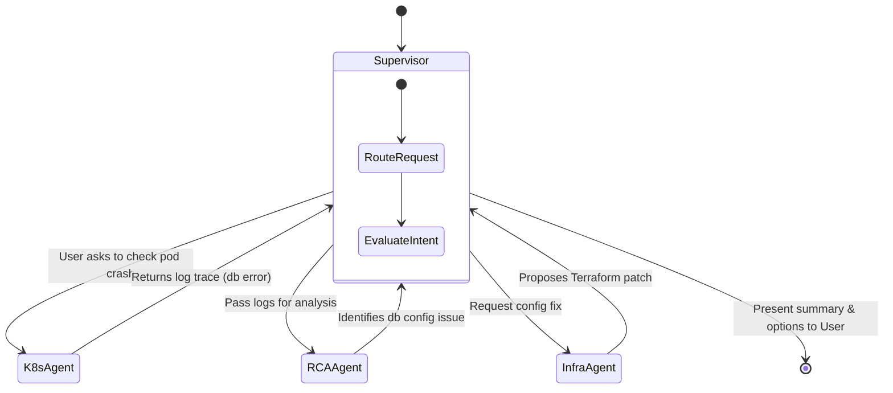

1. **State Sharing (LangGraph State)**: Agents access a shared, typed State schema containing `incident_context`, `active_errors`, `inspected_pods`, and `git_branch`.
2. **Handoff Rules**:
   - The **Supervisor Agent** routes incoming requests to a specific worker agent.
   - When an agent completes a task, it reports its findings back to the Supervisor, which evaluates if other tools or specialists are needed.
   - For example, if the **Incident Response Agent** detects an application error, it returns the error payload to the Supervisor, which routes it to the **Root Cause Agent** to inspect logs.

---

## 5. Security & Compliance Architecture

OpsPilot AI is built on a zero-trust model to safeguard secrets, cluster access details, and user data.

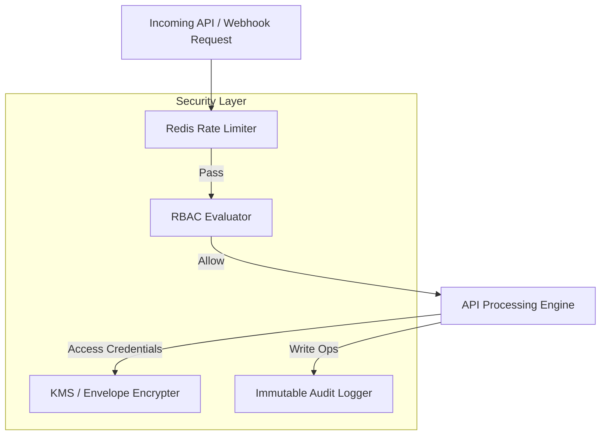

### 5.1 Authentication (AuthN) & Token Lifecycle
* **OAuth2 / OIDC Integration**: Leverages Enterprise OIDC providers (Okta, Google Workspace, Azure AD) for Single Sign-On (SSO).
* **JWT Strategy**: Access tokens are brief (15-minute lifespan, HS256/RS256), while refresh tokens (7-day lifespan) are stored in HTTP-only, secure, SameSite cookies. Refresh tokens must be rotated to prevent reuse.

### 5.2 Multi-Tenant Role-Based Access Control (RBAC)
Role definitions apply hierarchical, domain-specific access levels:

| Role | Scope | Permitted Actions |
| :--- | :--- | :--- |
| **OrgOwner** | Organization | Modify organization settings, manage billing, rotate KMS keys, invite members |
| **PlatformAdmin**| Cluster / System | Provision clusters, define system-wide network policies, change global secrets |
| **DevOpsEngineer**| Projects / Teams | Create applications, update pipelines, configure environments, trigger rollouts |
| **Developer** | Applications | View services, check logs, query incidents, trigger manual runs |
| **ReadOnly** | Organization | Inspect dashboards, view metrics, read read-only configs |

### 5.3 Secret Management & Envelope Encryption
* **Storage Pattern**: Sensitive connection strings, kubeconfigs, and API keys are not stored in plain text.
* **Envelope Encryption**: Secrets are encrypted locally using AES-256-GCM using a unique data encryption key (DEK). The DEK is encrypted using a key encryption key (KEK) managed by AWS KMS, GCP KMS, or HashiCorp Vault. The encrypted DEK is stored alongside the encrypted secret payload.

### 5.4 API Security & Rate Limiting
* **Rate Limiting Engine**: Evaluated at the API Gateway using a **Redis Token Bucket** algorithm.
* **Access Thresholds**:
  * Public/Webhook endpoints: 100 requests per minute per IP address.
  * Standard User API endpoints: 1,000 requests per minute per authenticated user token.
  * Vector/AI Generation queries: 30 requests per minute per user token (to prevent resource exhaustion).

### 5.5 Immutable Audit Logging
* **Mechanism**: Every POST, PUT, and DELETE operation generates a non-blocking background audit task.
* **Structure**: Writes to an audit log table partitioned by month. Permissions prevent delete operations on this table, and logs are forwarded to secure write-once, read-many (WORM) storage buckets (e.g., S3 Object Lock).

---

## 6. Observability & Telemetry Framework

OpsPilot AI coordinates platform metrics, container outputs, and trace spans through an unified OpenTelemetry collection system.

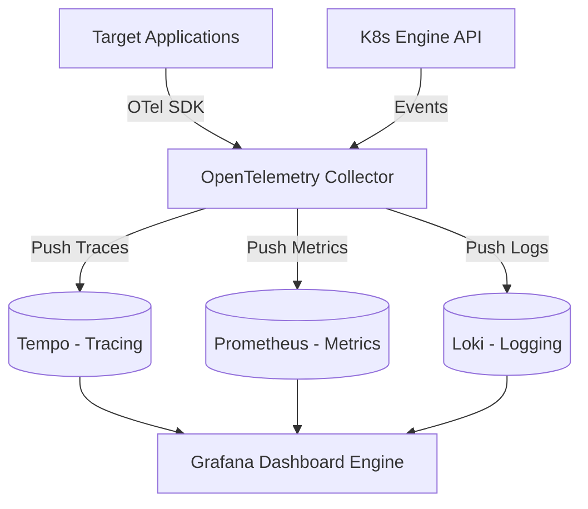

### 6.1 Metrics Architecture
* **Instrumentation**: Applications expose OpenTelemetry/Prometheus metrics endpoints (`/metrics`).
* **Core Metrics**: System performance metrics follow the **SRE Golden Signals**:
  * **Latency**: Time to complete requests.
  * **Traffic**: Demand on the system.
  * **Errors**: Rate of failed requests.
  * **Saturation**: Resource utilization levels.

### 6.2 Log Aggregation
* **Pipeline**: A Vector agent runs as a daemonset on target clusters, parsing docker stdout logs, enriching them with pod/namespace metadata, and streaming them to Loki.
* **Index Design**: High-cardinality values (e.g., individual user IDs) are excluded from index definitions. Indices use metadata labels like `cluster_id`, `namespace`, `app`, and `container`.

### 6.3 Distributed Tracing
* **Implementation**: OpenTelemetry middleware injects trace context headers (`traceparent`) across network transactions.
* **Sampling Policy**: 100% of error states are retained, while a 5% dynamic sampling rate is applied to standard, healthy transactions to manage storage consumption.

---

## 7. Scalability & High Availability Strategy

OpsPilot AI is designed to handle large-scale, enterprise operations workloads.

### 7.1 Horizontal Scaling
* **Stateless API Gateway**: The FastAPI container instances operate without local state, scaling horizontally behind an NGINX Ingress controller using a Kubernetes Horizontal Pod Autoscaler (HPA) configured for >70% average CPU utilization.
* **Distributed Task Processing**: Celery worker pods run on independent node pools, scaling dynamically based on task queue depth (`celery_queue_length`).

### 7.2 Multi-Level Caching (Redis)
* **Application Caching**: Standard API responses (e.g., pod lists, dashboard structures, system configs) are cached in Redis with short-term (60-second) TTLs to prevent database overload during traffic surges.
* **Distributed Session Store**: Used to manage active JWT session tokens and record real-time rate limit tallies.

### 7.3 Database Scaling
* **Read-Write Splitting**: The primary PostgreSQL instance handles state mutations, while multiple read replica instances manage search queries, dashboard reads, and dashboard rendering.
* **Database Partitioning**: Large tables (e.g., `metrics`, `audit_logs`, `notifications`) are partitioned by month to keep index sizes manageable and maintain query performance.

### 7.4 Kubernetes Scaling & High Availability
* **Cluster Autoscaler**: Deployed with AWS Karpenter or standard Cluster Autoscaler to dynamically provision target nodes.
* **Pod Topology Spread Constraints**: Pod replicas are distributed across multiple Availability Zones (AZs) using topology spread constraints to protect against zone failures.

---

## 8. Summary of Engineering Decisions

| Domain | Selected Technology | Engineering Rationale |
| :--- | :--- | :--- |
| **Frontend** | Next.js 15 App Router | Enables server-side rendering for speed, combined with React 19 for modern component rendering. |
| **Backend** | FastAPI + Uvicorn | High-performance asynchronous execution loop; perfect for WebSocket telemetry streams. |
| **Orchestration** | LangGraph | Supports cyclic graphs, which are essential for multi-agent reasoning, diagnostic runs, and self-healing loops. |
| **Task Broker** | Redis | Serves as both a quick message broker for Celery and a session/rate-limit store. |
| **Storage** | PostgreSQL + Qdrant | Relational transactions are handled by Postgres, while Qdrant stores vector embeddings for incident analysis. |
| **Observability** | OpenTelemetry | Open instrumentation standard that prevents vendor lock-in and works with Prometheus, Loki, and Tempo. |
