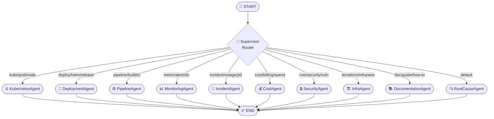

# OpsPilot AI — AI Platform Documentation

> Complete reference for the OpsPilot AI Operations platform — multi-agent architecture, LangGraph state machine design, agent catalog, tool registry, and ChatOps integration.

---

## Table of Contents

1. [Platform Overview](#platform-overview)
2. [LangGraph Architecture](#langgraph-architecture)
3. [AgentState Reference](#agentstate-reference)
4. [Supervisor Router](#supervisor-router)
5. [Agent Catalog](#agent-catalog)
6. [Tool Registry](#tool-registry)
7. [ChatOps Interface](#chatops-interface)
8. [AI Advisor](#ai-advisor)
9. [Incident Diagnosis Engine](#incident-diagnosis-engine)
10. [Postmortem Generator](#postmortem-generator)
11. [Extending the AI Platform](#extending-the-ai-platform)

---

## Platform Overview

The OpsPilot AI Operations Platform is a **multi-agent AIOps system** built on LangGraph and LangChain.

It is designed to:
- Answer natural language DevOps queries
- Diagnose incidents using real-time context
- Generate infrastructure recommendations
- Automate postmortem report drafts
- Route complex queries to the most capable specialized agent

```
┌──────────────────────────────────────────────────────────────┐
│                  AI Orchestrator Service                     │
│  ┌──────────────────────────────────────────────────────┐   │
│  │               LangGraph State Machine                │   │
│  │                                                      │   │
│  │   User Message ──→ Supervisor ──→ Specialized Agent  │   │
│  │         ↑                              │             │   │
│  │         └─── AgentState (shared) ──────┘             │   │
│  └──────────────────────────────────────────────────────┘   │
│                                                              │
│  Exposes: FastAPI  POST /api/v1/agent/run                   │
└──────────────────────────────────────────────────────────────┘
```

---

## LangGraph Architecture

The AI Orchestrator is implemented as a **LangGraph `StateGraph`** — a directed graph where nodes are agent functions and edges define routing logic.



### StateGraph Initialization

```python
workflow = StateGraph(AgentState)

workflow.add_node("supervisor", supervisor_node)
workflow.add_node("kubernetes_agent", make_agent_node("kubernetes_agent", "..."))
# ... all other agents

workflow.set_entry_point("supervisor")

workflow.add_conditional_edges(
    "supervisor",
    lambda state: state["active_agent"],
    {
        "kubernetes_agent": "kubernetes_agent",
        "deployment_agent": "deployment_agent",
        # ...
        "rootcause_agent": "rootcause_agent",
    }
)

workflow.add_edge("kubernetes_agent", END)
# ... all terminal edges

graph = workflow.compile()
```

---

## AgentState Reference

All agent nodes share a single `AgentState` TypedDict that flows through the graph:

```python
class AgentState(TypedDict):
    messages: List[dict]
    # Full conversation thread history
    # Format: [{"role": "user", "content": "..."}]

    active_agent: str
    # The agent node currently handling the request
    # Set by supervisor_node routing logic

    incident_context: dict
    # Incident metadata: title, severity, affected_services
    # Pre-populated if request comes from /diagnose endpoint

    active_errors: List[str]
    # Error messages discovered during analysis

    git_branch: str
    # Git branch context if pipeline-related

    reasoning_timeline: List[dict]
    # Chronological chain-of-thought entries
    # Format: [{"timestamp": "...", "thought": "...", "agent": "..."}]

    tool_outputs: List[dict]
    # Results from LangChain tool calls
    # Format: [{"tool": "...", "output": "..."}]

    confidence_score: float
    # Agent's confidence in the response (0.0 – 1.0)
```

---

## Supervisor Router

The `supervisor_node` implements **keyword-based intent routing** — a fast, deterministic strategy that avoids LLM routing latency.

```python
def supervisor_node(state: AgentState) -> dict:
    message_content = state["messages"][-1].get("content", "").lower()
    timestamp = datetime.utcnow().isoformat()

    # Keyword routing table
    routing_rules = [
        (["kube", "pod", "node", "namespace", "container"], "kubernetes_agent"),
        (["deploy", "helm", "release", "rollback", "rollout"], "deployment_agent"),
        (["pipeline", "build", "ci", "job", "artifact"], "pipeline_agent"),
        (["metric", "alert", "slo", "sli", "latency", "throughput"], "monitoring_agent"),
        (["incident", "outage", "p0", "p1", "down", "degraded"], "incident_agent"),
        (["cost", "billing", "spend", "budget", "rightsiz"], "cost_agent"),
        (["cve", "security", "vulnerability", "scan", "compliance"], "security_agent"),
        (["terraform", "aws", "infra", "provision"], "infra_agent"),
        (["doc", "guide", "how", "example", "tutorial"], "documentation_agent"),
    ]

    next_agent = "rootcause_agent"  # default fallback
    for keywords, agent in routing_rules:
        if any(kw in message_content for kw in keywords):
            next_agent = agent
            break

    return {
        "active_agent": next_agent,
        "reasoning_timeline": state.get("reasoning_timeline", []) + [{
            "timestamp": timestamp,
            "thought": f"Supervisor routed to {next_agent}",
            "agent": "supervisor"
        }]
    }
```

---

## Agent Catalog

| Agent | Route Keywords | Primary Capability |
|---|---|---|
| **KubernetesAgent** | `kube`, `pod`, `node`, `namespace` | Pod status, resource usage, cluster health |
| **DeploymentAgent** | `deploy`, `helm`, `release`, `rollback` | Helm release management, rollout analysis |
| **PipelineAgent** | `pipeline`, `build`, `ci`, `job` | CI/CD status, failure diagnosis, artifact info |
| **MonitoringAgent** | `metric`, `alert`, `slo`, `latency` | SLO burn rate, alert suppression, metric queries |
| **IncidentAgent** | `incident`, `outage`, `p0`, `p1` | Incident creation, severity triage, timeline construction |
| **CostAgent** | `cost`, `billing`, `spend`, `budget` | Cloud cost recommendations, rightsizing |
| **SecurityAgent** | `cve`, `security`, `vuln`, `scan` | Vulnerability findings, compliance status |
| **InfraAgent** | `terraform`, `aws`, `infra`, `provision` | IaC state, resource drift detection |
| **DocumentationAgent** | `doc`, `guide`, `how`, `tutorial` | Runbook lookup, documentation generation |
| **RootCauseAgent** | *(default)* | Multi-signal root cause analysis, incident postmortem |

### Agent Node Constructor

All agents use a shared `make_agent_node` factory:

```python
def make_agent_node(agent_name: str, response_template: str):
    def agent_node(state: AgentState) -> dict:
        timestamp = datetime.utcnow().isoformat()
        user_message = state["messages"][-1].get("content", "")

        response_content = f"[Agent: {agent_name.upper()}] {response_template}"

        updated_messages = state["messages"] + [{
            "role": "assistant",
            "content": response_content
        }]

        updated_timeline = state.get("reasoning_timeline", []) + [{
            "timestamp": timestamp,
            "thought": f"Executed {agent_name}. Analyzing: {user_message[:50]}...",
            "agent": agent_name
        }]

        return {
            "messages": updated_messages,
            "reasoning_timeline": updated_timeline,
            "confidence_score": 0.98,
            "tool_outputs": []
        }
    return agent_node
```

---

## Tool Registry

LangChain tools available to agents:

| Tool | Class | Description |
|---|---|---|
| `kubernetes_query` | `KubernetesQueryTool` | Query Kubernetes API for pod/deployment status |
| `helm_release_status` | `HelmStatusTool` | Get Helm release revision history |
| `prometheus_query` | `PrometheusQueryTool` | PromQL metric evaluation |
| `loki_log_search` | `LokiSearchTool` | Full-text log search |
| `github_pr_status` | `GitHubTool` | PR review status, CI check results |
| `terraform_state` | `TerraformTool` | Parse remote Terraform state |
| `cost_explorer` | `AWSCostTool` | AWS Cost Explorer API |
| `vault_secret_check` | `VaultTool` | Verify secret rotation status |

---

## ChatOps Interface

Users interact with the AI platform through the ChatOps console at `/ai`.

### Frontend Flow

1. User types a query in the chat input
2. `POST /api/v1/ai/chat` is called with `{ prompt, conversation_id }`
3. FastAPI saves the user message to `ai_messages` table
4. FastAPI calls `POST http://ai-orchestrator:8002/api/v1/agent/run`
5. LangGraph executes the full graph (Supervisor → Agent)
6. Response is returned and saved as assistant message
7. Frontend renders response + expandable reasoning timeline

### Conversation Persistence

All conversations are stored in PostgreSQL:
- `ai_conversations` — session containers (linked to project)
- `ai_messages` — individual messages with `role`, `content`, and `thoughts`

### Reasoning Timeline UI

The `thoughts` field stores the serialized `reasoning_timeline` from AgentState. The frontend renders this as an expandable "Thought Process" panel beneath each assistant message.

---

## AI Advisor

The AI Advisor (`/ai/advisor`) proactively generates infrastructure recommendations.

**Endpoint:** `POST /api/v1/ai/recommend`

Returns structured recommendations with:
- `category`: Cost Optimization | Security | Performance | Reliability
- `impact`: High | Medium | Low
- `confidence`: 0.0–1.0
- `description`: What to do and why
- `actions`: Step-by-step remediation list

---

## Incident Diagnosis Engine

**Endpoint:** `POST /api/v1/ai/diagnose`

Request body: `{ "incident_id": "<uuid>" }`

The diagnosis flow:
1. Fetches incident record from PostgreSQL
2. Constructs an `AgentState` pre-loaded with `incident_context`
3. Passes query `"Diagnose this incident"` to the LangGraph graph
4. RootCauseAgent executes with incident context
5. Returns structured diagnosis: root cause, confidence, reasoning steps

---

## Postmortem Generator

**Endpoint:** `POST /api/v1/ai/postmortem?incident_id=<uuid>`

Generates a formatted postmortem document including:
- Incident timeline
- Root cause analysis summary
- Contributing factors
- Corrective actions

---

## Extending the AI Platform

### Adding a New Agent

1. Register node in `apps/ai-orchestrator/src/langgraph/graph.py`
2. Add routing keywords to `supervisor_node`
3. Add conditional edge mapping
4. Add terminal `add_edge(..., END)` for the new node

See the [Developer Guide](developer_guide.md#adding-a-new-ai-agent) for the full walkthrough.

### Future Roadmap

| Feature | Status |
|---|---|
| Qdrant vector memory | Planned v1.2 |
| MCP tool server integration | Planned v1.3 |
| LLM-based supervisor (GPT-4o routing) | Planned v1.5 |
| Streaming response support (SSE) | Planned v1.1 |
| Agent feedback scoring | Planned v1.4 |
