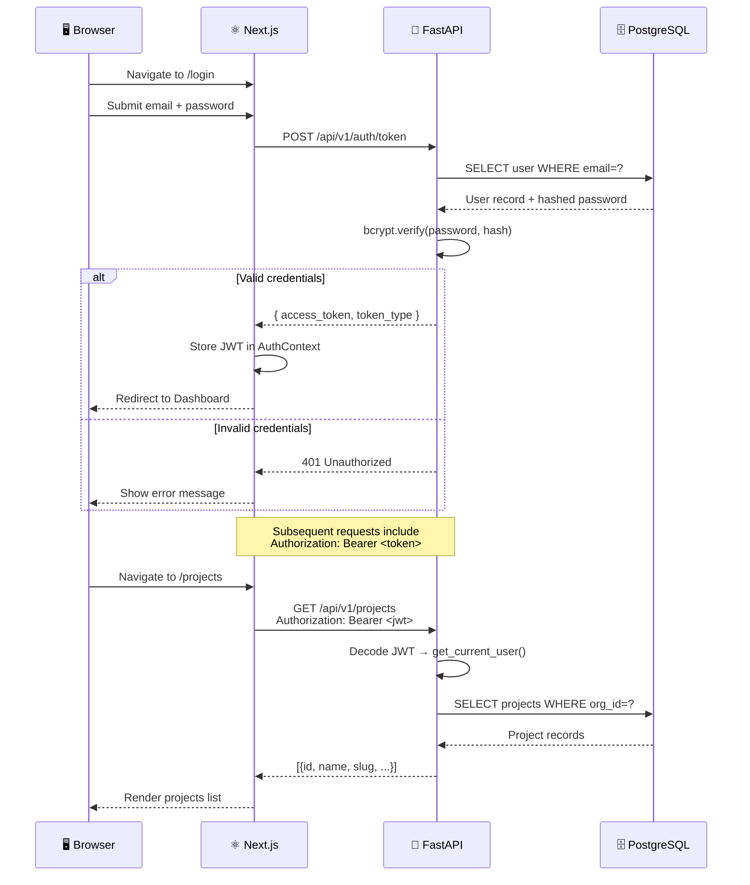
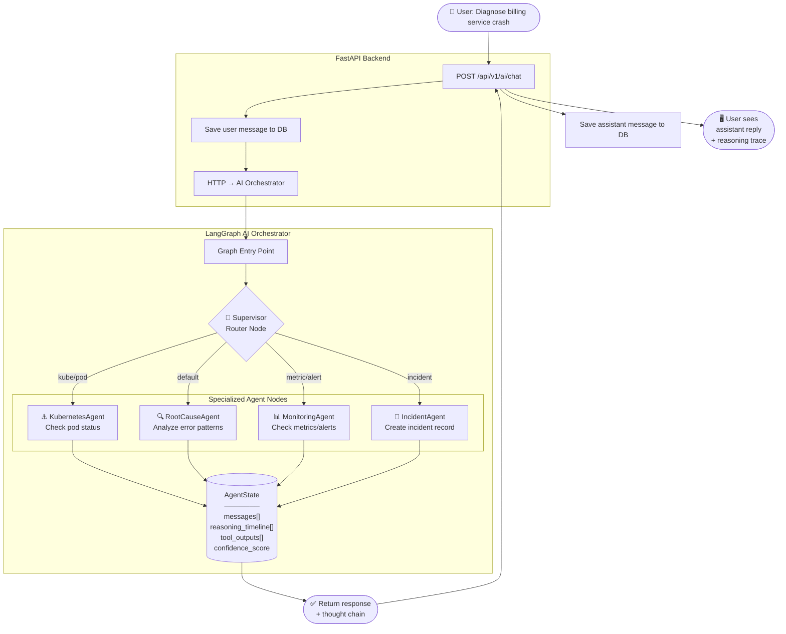
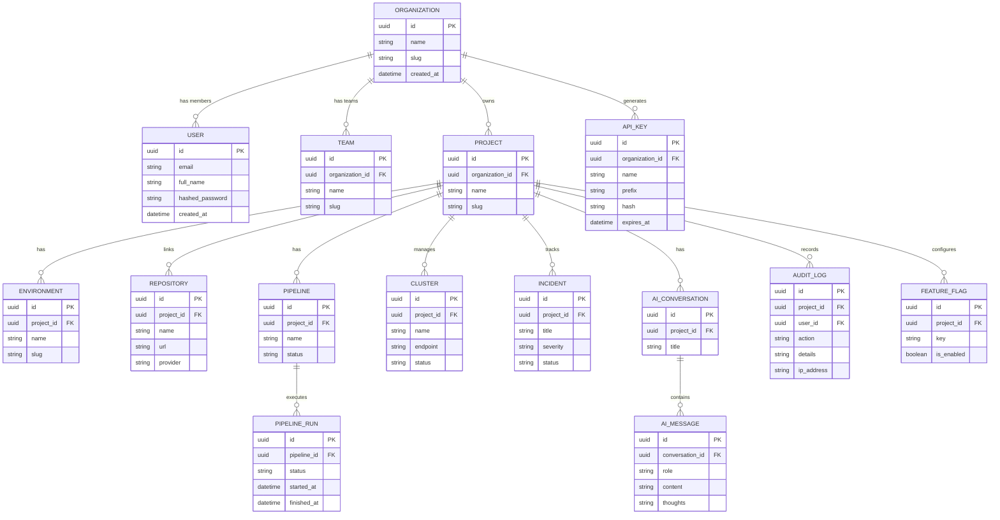

# OpsPilot AI — Architecture Guide

> This guide describes the complete technical architecture of OpsPilot AI — microservices topology, data flows, database model relationships, AI agent orchestration, and deployment patterns.

---

## Table of Contents

1. [System Overview](#system-overview)
2. [Microservices Topology](#microservices-topology)
3. [Authentication Flow](#authentication-flow)
4. [CI/CD Pipeline Flow](#cicd-pipeline-flow)
5. [AI Agent Orchestration Flow](#ai-agent-orchestration-flow)
6. [Database Entity Relationships](#database-entity-relationships)
7. [Kubernetes Deployment Architecture](#kubernetes-deployment-architecture)
8. [Observability Architecture](#observability-architecture)
9. [Secrets Management Architecture](#secrets-management-architecture)

---

## System Overview

OpsPilot AI is composed of **three independent microservices** connected through REST APIs and a shared data layer:

| Service | Technology | Port | Responsibility |
|---|---|---|---|
| **Frontend** | Next.js 15 | 3000 | Web console and user interface |
| **Backend** | FastAPI | 8000 | API gateway, business logic, DB access |
| **AI Orchestrator** | FastAPI + LangGraph | 8002 | Multi-agent AI execution engine |

**Supporting infrastructure:**

| Component | Technology | Port |
|---|---|---|
| **Database** | PostgreSQL 16 | 5432 |
| **Cache / Queue** | Redis | 6379 |
| **Task Worker** | Celery | — |

---

## Microservices Topology

```mermaid
graph TB
    subgraph Users["👥 Users"]
        Browser([Web Browser])
        API_Client([API Client / CLI])
        Webhook([Git Webhook])
    end

    subgraph Frontend["⚛️ Frontend Service (Next.js 15)"]
        Pages[App Router Pages]
        AuthCtx[Auth Context Provider]
        Components[UI Component Library]
    end

    subgraph Backend["🔌 Backend Service (FastAPI)"]
        direction TB
        Router[API Router]
        AuthMW[JWT Middleware]
        RBAC[RBAC Permission Guards]

        subgraph Routers["Route Handlers"]
            AuthR[/auth]
            OrgR[/organizations]
            ProjR[/projects]
            PipeR[/pipelines]
            K8sR[/kubernetes]
            ObsR[/observability]
            AIR[/ai]
            GovR[/governance]
        end
    end

    subgraph AI["🧠 AI Orchestrator (LangGraph)"]
        Supervisor[Supervisor Router Node]
        Agents[10x Specialized Agents]
        State[AgentState Context]
    end

    subgraph Data["🗄️ Data Layer"]
        PG[(PostgreSQL)]
        Redis[(Redis)]
        Celery[Celery Worker]
    end

    Browser --> Pages --> Router
    API_Client --> Router
    Webhook --> PipeR
    Router --> AuthMW --> RBAC --> Routers
    Routers --> PG
    Routers --> Redis
    PipeR --> Redis --> Celery
    AIR --> Supervisor --> Agents
    Agents --> State
```

---

## Authentication Flow



---

## CI/CD Pipeline Flow

```mermaid
sequenceDiagram
    participant Dev as 👨‍💻 Developer
    participant Git as 🐙 GitHub
    participant Webhook as 🔔 Webhook Handler
    participant API as 🔌 FastAPI
    participant DB as 🗄️ PostgreSQL
    participant Queue as 📋 Redis Queue
    participant Worker as ⚙️ Celery Worker
    participant K8s as ⚓ Kubernetes

    Dev->>Git: git push origin main
    Git->>Webhook: POST /webhooks/github (push event)
    Webhook->>API: Trigger pipeline run
    API->>DB: INSERT PipelineRun (status=PENDING)
    API->>Queue: celery.send_task("run_pipeline", run_id)
    Queue-->>Worker: Consume task

    rect rgb(30, 40, 60)
        Note over Worker: Pipeline Execution
        Worker->>Worker: Clone repository
        Worker->>Worker: Install dependencies
        Worker->>Worker: Run build step
        Worker->>Worker: Run test step
        Worker->>Worker: Build Docker image
        Worker->>DB: UPDATE PipelineRun step statuses
    end

    alt Build Success
        Worker->>K8s: helm upgrade --install ...
        Worker->>DB: UPDATE PipelineRun (status=SUCCESS)
    else Build Failure
        Worker->>DB: UPDATE PipelineRun (status=FAILED)
        Worker->>API: Emit incident event
    end

    API-->>Dev: Notification via Slack/Email
```



---

## AI Agent Orchestration Flow



---

## Database Entity Relationships



---

## Kubernetes Deployment Architecture

```mermaid
graph TB
    subgraph Internet["🌐 Internet"]
        Users([Users])
    end

    subgraph Cluster["☸️ Kubernetes Cluster (EKS)"]
        subgraph Ingress["🔀 Ingress Layer"]
            NGINX[nginx-ingress-controller]
        end

        subgraph Namespaces["📦 Namespace: opspilot"]
            subgraph Frontend_Pod["Frontend Pods (×2)"]
                FE1[frontend-pod-1]
                FE2[frontend-pod-2]
            end

            subgraph Backend_Pod["Backend Pods (×2)"]
                BE1[backend-pod-1]
                BE2[backend-pod-2]
            end

            subgraph AI_Pod["AI Orchestrator Pods (×1)"]
                AI1[ai-orchestrator-pod-1]
            end

            subgraph Data["Data Services"]
                PG_Svc[PostgreSQL StatefulSet]
                Redis_Svc[Redis StatefulSet]
            end

            subgraph Config["Configuration"]
                CM[ConfigMap:\napp-config]
                Secrets[Secrets:\nvault-injected]
            end
        end

        subgraph Scaling["⚡ Autoscaling"]
            HPA[HorizontalPodAutoscaler\nCPU: 70% threshold]
        end
    end

    Users --> NGINX
    NGINX -->|"/"|  FE1 & FE2
    NGINX -->|"/api/*"| BE1 & BE2
    BE1 & BE2 --> PG_Svc
    BE1 & BE2 --> Redis_Svc
    BE1 & BE2 --> AI1
    CM --> BE1 & BE2
    Secrets --> BE1 & BE2
    HPA --> Frontend_Pod & Backend_Pod
```

---

## Observability Architecture

```mermaid
graph LR
    subgraph Services["Application Services"]
        Backend[FastAPI Backend]
        Frontend[Next.js Frontend]
        AI[AI Orchestrator]
    end

    subgraph Collection["Data Collection"]
        OTel[OpenTelemetry\nCollector]
        StructLog[structlog\nJSON Logs]
    end

    subgraph Storage["Metric & Log Storage"]
        Prometheus[(Prometheus\nMetrics TSDB)]
        Loki[(Loki\nLog Store)]
        Tempo[(Tempo\nTrace Store)]
    end

    subgraph Dashboards["OpsPilot Dashboards"]
        MetricsPage[/observability\nMetrics Dashboard]
        LogsPage[/observability/logs\nLog Explorer]
        TracePage[/observability/traces\nTrace Viewer]
        IncidentPage[/observability/incidents\nIncident Manager]
    end

    Backend --> OTel
    Frontend --> OTel
    AI --> OTel
    Backend --> StructLog

    OTel --> Prometheus
    OTel --> Tempo
    StructLog --> Loki

    Prometheus --> MetricsPage
    Loki --> LogsPage
    Tempo --> TracePage
    Prometheus --> IncidentPage
```

---

## Secrets Management Architecture

```mermaid
graph TD
    subgraph Dev["👨‍💻 Developer"]
        DevAction[Registers secret via\n/api/v1/secrets]
    end

    subgraph Backend["FastAPI Backend"]
        SecretsAPI[/api/v1/secrets endpoint]
        VaultClient[Vault HTTP Client]
    end

    subgraph Vault["🔐 HashiCorp Vault"]
        KMS[KMS Auto-Unseal]
        Store[(Encrypted\nSecret Store)]
        Audit[Vault Audit Log]
    end

    subgraph K8s["☸️ Kubernetes"]
        VaultAgent[Vault Agent\nSidecar Injector]
        EnvInjection[Environment Variable\nInjection at runtime]
    end

    DevAction --> SecretsAPI
    SecretsAPI --> VaultClient
    VaultClient --> KMS
    KMS --> Store
    Store --> Audit
    Store --> VaultAgent
    VaultAgent --> EnvInjection
    EnvInjection -->|"DATABASE_URL\nJWT_SECRET"| PodRuntime[Pod Runtime\nEnvironment]
```
