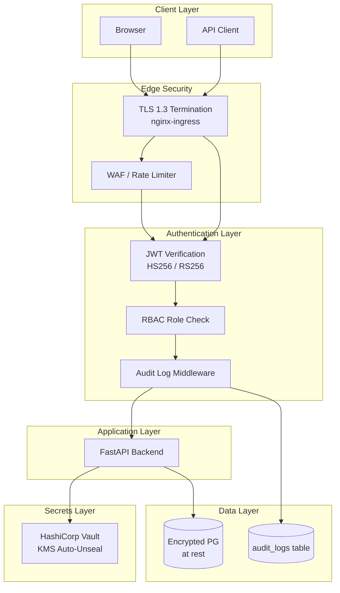

# OpsPilot AI — Security Guide

> This guide documents OpsPilot AI's security architecture, authentication model, role-based access control, secret management, audit logging, and security hardening posture for production deployments.

---

## Table of Contents

1. [Security Architecture Overview](#security-architecture-overview)
2. [Authentication & JWT](#authentication--jwt)
3. [Role-Based Access Control (RBAC)](#role-based-access-control-rbac)
4. [API Key Management](#api-key-management)
5. [Secret Management (Vault)](#secret-management-vault)
6. [Audit Logging](#audit-logging)
7. [Network Security](#network-security)
8. [Container Security](#container-security)
9. [Dependency Security](#dependency-security)
10. [Security Hardening Checklist](#security-hardening-checklist)

---

## Security Architecture Overview



---

## Authentication & JWT

### Token Generation

Tokens are issued via `POST /api/v1/auth/token` using standard OAuth2 Password Grant flow.

```python
# Password hashing
hashed_password = bcrypt.hashpw(password.encode(), bcrypt.gensalt())

# Token generation
payload = {
    "sub": str(user.id),
    "email": user.email,
    "exp": datetime.utcnow() + timedelta(minutes=60)
}
token = jwt.encode(payload, JWT_SECRET_KEY, algorithm="HS256")
```

### Token Verification Dependency

```python
async def get_current_user(
    token: str = Depends(oauth2_scheme),
    db: AsyncSession = Depends(get_session)
) -> User:
    try:
        payload = jwt.decode(token, JWT_SECRET_KEY, algorithms=["HS256"])
        user_id = payload.get("sub")
    except JWTError:
        raise HTTPException(status_code=401, detail="Invalid authentication credentials")

    user = await db.get(User, user_id)
    if not user:
        raise HTTPException(status_code=401, detail="User not found")
    return user
```

### Security Properties

| Property | Value | Rationale |
|---|---|---|
| Algorithm | HS256 | Fast, secure for monolithic auth |
| Expiry | 60 minutes | Balance between usability and security |
| Secret length | 256 bits | Protects against brute force |
| Password hashing | bcrypt | Industry standard, slow by design |

### Production Recommendations

- Rotate `JWT_SECRET_KEY` every 90 days via Vault dynamic secrets
- Move to RS256 for multi-service token verification
- Implement refresh token flow for sessions > 60 minutes

---

## Role-Based Access Control (RBAC)

OpsPilot implements a **5-tier role hierarchy** scoped to organizations:

| Role | Scope | Capabilities |
|---|---|---|
| `OrgOwner` | Organization | All operations, billing, invite members, delete org |
| `Admin` | Organization | All operations except billing and org deletion |
| `DevOpsEngineer` | Project | Manage pipelines, deployments, Kubernetes, secrets |
| `Developer` | Project | View pipelines, create pipeline runs, read environments |
| `Viewer` | Project | Read-only access to all resources |

### Role Model

```python
class TeamMembership(SQLModel, table=True):
    __tablename__ = "team_memberships"
    user_id: UUID = Field(foreign_key="users.id", primary_key=True)
    team_id: UUID = Field(foreign_key="teams.id", primary_key=True)
    role_name: str  # "OrgOwner" | "Admin" | "DevOpsEngineer" | "Developer" | "Viewer"
```

### RBAC Enforcement

Implement per-endpoint role guards using FastAPI dependencies:

```python
def require_role(*allowed_roles: str):
    def dependency(current_user: User = Depends(get_current_user)):
        user_role = current_user.role_name  # resolved from org membership
        if user_role not in allowed_roles:
            raise HTTPException(status_code=403, detail="Insufficient permissions")
        return current_user
    return dependency

# Usage in router
@router.delete("/{id}")
async def delete_cluster(
    id: UUID,
    _: User = Depends(require_role("OrgOwner", "Admin")),
    db: AsyncSession = Depends(get_session),
):
    ...
```

---

## API Key Management

API keys allow machine-to-machine authentication for CI/CD systems.

### Key Design

| Property | Implementation |
|---|---|
| Format | `op_<random_24_chars>` — prefixed for detection |
| Storage | SHA-256 hash stored, never plaintext |
| Scope | `read` or `write` |
| Expiry | Configurable per key (1–365 days) |
| Detection | Regex pattern `op_[a-zA-Z0-9]{24}` for secret scanning |

### Key Generation

```python
raw_key = f"op_{secrets.token_urlsafe(18)}"   # ~24 chars
hashed_key = hashlib.sha256(raw_key.encode()).hexdigest()
prefix = raw_key[:8]  # "op_abc12"

api_key = ApiKey(
    organization_id=org_id,
    name=name,
    prefix=prefix,
    hash=hashed_key,
    scope=scope,
    expires_at=datetime.utcnow() + timedelta(days=expires_days)
)
```

### Key Rotation Policy

- Rotate all API keys every **90 days**
- Immediately revoke keys when team members offboard
- Never log or expose raw key values beyond creation response

---

## Secret Management (Vault)

OpsPilot integrates with HashiCorp Vault for storing application secrets.

### Architecture

```
Developer → POST /api/v1/secrets
FastAPI Backend → Vault HTTP Client
Vault KMS (Auto-Unseal) → Encrypted Storage
Vault Agent Sidecar → Pod Environment Injection (production)
```

### Secret Storage Pattern

```python
import hvac

client = hvac.Client(url="http://vault:8200", token=VAULT_TOKEN)

def store_secret(path: str, key: str, value: str):
    client.secrets.kv.v2.create_or_update_secret(
        path=f"opspilot/{path}",
        secret={key: value}
    )

def retrieve_secret(path: str, key: str) -> str:
    result = client.secrets.kv.v2.read_secret_version(
        path=f"opspilot/{path}"
    )
    return result["data"]["data"][key]
```

### Vault Policies

Limit backend service access to its own secret namespace:

```hcl
path "secret/data/opspilot/*" {
  capabilities = ["read", "list"]
}

path "secret/metadata/opspilot/*" {
  capabilities = ["list"]
}
```

---

## Audit Logging

All write operations are recorded in the `audit_logs` table.

### Audit Log Schema

```python
class AuditLog(SQLModel, table=True):
    __tablename__ = "audit_logs"
    id: UUID
    project_id: UUID
    user_id: UUID
    action: str         # "api_key.create" | "incident.resolve" | "secret.access"
    details: str        # Human-readable description
    ip_address: str
    created_at: datetime
```

### Logged Events

| Category | Events |
|---|---|
| **Auth** | `auth.login`, `auth.logout`, `auth.failed` |
| **API Keys** | `api_key.create`, `api_key.revoke` |
| **Secrets** | `secret.create`, `secret.access`, `secret.delete` |
| **Pipeline** | `pipeline.trigger`, `pipeline.cancel` |
| **Kubernetes** | `cluster.import`, `deployment.scale` |
| **Incidents** | `incident.create`, `incident.resolve` |
| **Governance** | `feature_flag.toggle`, `org_settings.update` |

### Viewing Audit Logs

```http
GET /api/v1/audit
Authorization: Bearer <token>
X-Project-ID: {project_id}
```

Logs are immutable — no update or delete endpoint exists.

---

## Network Security

### Kubernetes Network Policies

Restrict pod-to-pod communication:

```yaml
apiVersion: networking.k8s.io/v1
kind: NetworkPolicy
metadata:
  name: backend-ingress
  namespace: opspilot
spec:
  podSelector:
    matchLabels:
      app: opspilot-backend
  policyTypes:
    - Ingress
    - Egress
  ingress:
    - from:
        - podSelector:
            matchLabels:
              app: opspilot-frontend
      ports:
        - port: 8000
  egress:
    - to:
        - podSelector:
            matchLabels:
              app: postgres
      ports:
        - port: 5432
    - to:
        - podSelector:
            matchLabels:
              app: redis
      ports:
        - port: 6379
```

### TLS Configuration

- **Minimum TLS version**: 1.2 (prefer 1.3)
- **Certificate management**: cert-manager + Let's Encrypt
- **Internal service communication**: mTLS via service mesh (Linkerd/Istio)

### CORS Configuration

```python
app.add_middleware(
    CORSMiddleware,
    allow_origins=["https://app.opspilot.io"],  # Never * in production
    allow_credentials=True,
    allow_methods=["GET", "POST", "PUT", "PATCH", "DELETE"],
    allow_headers=["Authorization", "Content-Type", "X-Project-ID", "X-Org-ID"],
)
```

---

## Container Security

### Image Hardening

- Use `python:3.11-slim` — no unnecessary packages
- Run as non-root user:
  ```dockerfile
  RUN addgroup --system opspilot && adduser --system --group opspilot
  USER opspilot
  ```
- Read-only root filesystem:
  ```yaml
  securityContext:
    readOnlyRootFilesystem: true
    allowPrivilegeEscalation: false
    capabilities:
      drop: ["ALL"]
  ```

### Image Scanning

Scan images in CI before deployment:

```yaml
- name: Scan image for vulnerabilities
  uses: aquasecurity/trivy-action@master
  with:
    image-ref: opspilot-backend:${{ github.sha }}
    severity: 'CRITICAL,HIGH'
    exit-code: '1'
```

---

## Dependency Security

### Python

```bash
# Check for known vulnerabilities
poetry run pip-audit

# Update dependencies
poetry update

# Verify dependency hashes
poetry install --verify-hashes
```

### Node.js

```bash
# Check vulnerabilities
pnpm audit

# Fix automatically
pnpm audit --fix
```

---

## Security Hardening Checklist

### Authentication
- [ ] `JWT_SECRET_KEY` is ≥ 256 bits, stored in Vault
- [ ] Token expiry is ≤ 60 minutes
- [ ] Passwords hashed with bcrypt (cost factor ≥ 12)
- [ ] No plaintext passwords in logs

### RBAC
- [ ] All endpoints have role guards
- [ ] `Viewer` role cannot trigger write operations
- [ ] Service accounts use least-privilege roles

### API Keys
- [ ] Raw keys are only shown at creation time
- [ ] Keys stored as SHA-256 hashes only
- [ ] All keys have expiry dates
- [ ] Revocation is immediate

### Secrets
- [ ] No secrets in `.env` files in production
- [ ] Vault Agent Injector used for Kubernetes secrets
- [ ] Secret rotation automated via Vault dynamic secrets
- [ ] Vault audit log enabled

### Network
- [ ] TLS 1.3 on all public endpoints
- [ ] CORS origin list is explicit (no `*`)
- [ ] Network policies restrict pod-to-pod traffic
- [ ] No services exposed with `NodePort` in production

### Container
- [ ] All containers run as non-root
- [ ] `allowPrivilegeEscalation: false` on all pods
- [ ] Image vulnerability scanning in CI pipeline
- [ ] Images pinned to specific digests (not `latest`)

### Audit
- [ ] All write operations emit audit log entries
- [ ] Audit logs are immutable (no delete endpoint)
- [ ] Audit logs retained for ≥ 90 days
