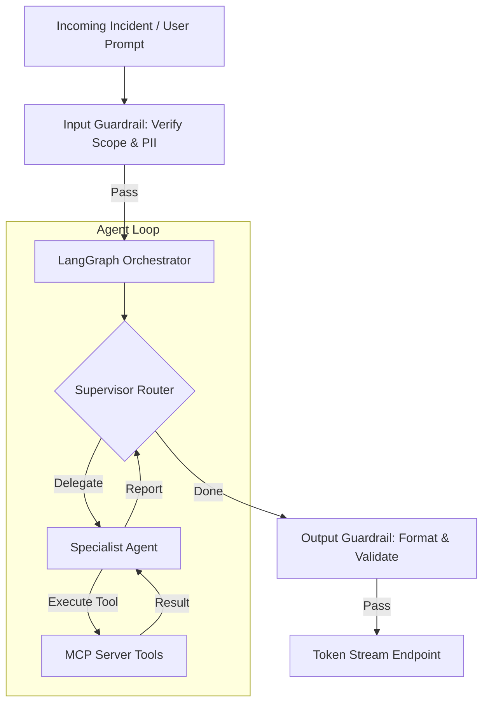

# OpsPilot AI: Phase 5 Enterprise Implementation Blueprint & Engineering Handbook

This document establishes the official engineering handbook, architecture principles, implementation guidelines, and code quality standards for **OpsPilot AI**—an Autonomous AI DevOps & Cloud Operations Platform.

---

## 1. Implementation Principles

Every component in the OpsPilot monorepo must be built in accordance with these software engineering principles to guarantee long-term testability and code quality.

* **Clean Architecture**: System layers must be separated. High-level business rules (AI diagnostic graphs, deployment orchestrators) must not depend on low-level implementation details (PostgreSQL query structure, Redis socket libraries). Interactions must cross boundaries via abstract interfaces.
* **SOLID Principles**:
  * *Single Responsibility Principle*: Every module, class, or function must have one reason to change. For example, the `LokiTool` must only handle raw log retrieval, leaving parsing rules to the `RootCauseAgent`.
  * *Open/Closed Principle*: Systems must be open for extension but closed for modification. New AI agents must be registered via the supervisor graph without changing other agents' core logic.
  * *Liskov Substitution Principle*: Subclasses must be substitutable for their base types. Custom tools must conform to the base `MCPTool` interface.
  * *Interface Segregation Principle*: Clients must not be forced to depend on interfaces they do not use.
  * *Dependency Inversion Principle*: High-level modules must depend on abstractions. We inject repositories into services, never instantiating connections directly within router calls.
* **Separation of Concerns (SoC)**: Separate operations. For example, route handlers parse parameters, services evaluate business logic, and database repositories handle data access.
* **Dependency Injection (DI)**: Class dependencies must be provided as parameters. In Python, use FastAPI’s dependency injection system (`Depends`). In React, use Context providers or Zustand store injections.
* **Composition over Inheritance**: Assemble behavior dynamically by combining simpler objects rather than building deep inheritance trees.
* **Domain-Driven Design (DDD)**: Group core system scopes into bounded contexts (e.g. Identity Management, Release Pipelines, Cluster Observability) to define clear terminology, database ownership, and validation rules.

---

## 2. Backend Coding Standards (Python / FastAPI)

```text
FastAPI Router (Parses Inputs, Handles HTTP Protocols)
      ↓
FastAPI Depends (Injects Services & Security Rules)
      ↓
Service Layer (Implements Core Business Logic & Fires Events)
      ↓
Repository Layer (Abstracts Database Queries using SQLModel)
      ↓
PostgreSQL / Redis (Data Layer)
```

* **Folder Organization**: Files must follow the feature structure outlined in the monorepo blueprint. Place controllers in `/routers/`, queries in `/repositories/`, schemas in `/schemas/`, and business logic in `/services/`.
* **Service & Repository Layer Decoupling**: Routers must not execute database queries. They call the service layer, which queries the database using repository instances.
* **Dependency Injection**: Use FastAPI `Depends` for request contexts, database sessions, authentication, and service instances.
* **DTOs & Schemas**: Use Pydantic models to validate input payloads and structure responses. Database models must not be exposed directly in API responses.
* **Error Handling**: Throw typed domain exceptions in services (e.g., `ClusterNotFoundError`). A global FastAPI exception handler catches these exceptions, maps them to RFC 7807 formats, logs the details with trace IDs, and returns the appropriate HTTP status code.
* **Logging System**: Use structured JSON logging (`structlog`). Every log entry must include: `trace_id`, `timestamp`, `severity`, `module`, and relevant metadata (e.g., `user_id`, `cluster_id`).
* **Background Workers**: Use Celery for background tasks. Long-running tasks must update their progress in Redis to support real-time WebSocket updates.
* **Transactions**: Use database transactions (`BEGIN/COMMIT`) to ensure operations are atomic. Wrap multi-table modifications in a `with db.begin():` block to roll back changes on error.

---

## 3. Frontend Coding Standards (Next.js 15 / React 19)

* **Feature-First Architecture**: Group code by feature domains (e.g., `/features/monitoring/`) containing their own components, hooks, and stores. Avoid generic folders like `/components/` for feature-specific code.
* **Server vs. Client Components**:
  * *Server Components* (Default): Use for data fetching, static layouts, and initial page rendering.
  * *Client Components* (`"use client"`): Use only when requiring browser APIs, interactivity (buttons, forms), state management, or WebSockets.
* **API Client**: Wrap fetches in a custom Axios instance with automatic token renewal, request retries, and rate limit handling.
* **Zustand State Stores**: Use Zustand to manage client-side state (sidebar toggles, user preferences). Global state stores must be scoped to prevent unnecessary component re-renders.
* **Form Validation**: Use `react-hook-form` paired with `zod` schema validation to validate inputs on the client before submitting requests.
* **Lazy Loading**: Use dynamic imports (`next/dynamic`) to lazy-load heavy UI elements (such as charts, editors, and terminals) to keep initial bundle sizes small.
* **Error Boundaries**: Wrap major page sections in React Error Boundaries to catch frontend errors and display fallback UIs without crashing the entire page.
* **Accessibility (A11y)**: Use semantic HTML elements. Interactive components must support keyboard navigation (focus traps on modals, `Tab` loop controls) and provide `aria-*` tags for screen readers.

---

## 4. AI & Agent Standards



* **Agent Implementations**: Every agent must extend a base `BaseAgent` class, defining its default prompts, tools, and memory stores.
* **Orchestration**: Manage multi-agent workflows using **LangGraph** state machines. The graph state must be typed, validated, and updated explicitly at each node.
* **Prompt Storage**: Save prompts in structured YAML files (e.g. `k8s_diagnose.yaml`) with versioning metadata. Do not hardcode prompts in application code.
* **Memory Management**:
  * *Short-term*: Store in-progress conversational context in Redis.
  * *Long-term*: Store incident summaries, resolution post-mortems, and runbook indexes in **Qdrant** as vector embeddings.
* **MCP Tools Integration**:
  * Custom tools must expose standard Model Context Protocol (MCP) schemas.
  * Wrap tool calls in safety wrappers that enforce execution timeouts, validate returned data, and capture exit codes.
* **Resilience Framework**:
  * Tool calls must include retry policies (maximum of 3 retries with exponential backoff).
  * If an LLM tool call fails persistently, fall back to a safe human-in-the-loop validation request.
* **Guardrails**:
  * *Input Guardrails*: Check incoming queries for injection patterns, system command attempts, or PII leaks before sending them to the LLM.
  * *Output Guardrails*: Validate agent responses to ensure they match requested JSON formats and do not contain raw system keys.
* **Token Budgeting**: Implement system-wide token limits per conversation thread. When a thread approaches the limit, compress the history summary to preserve context window space.

---

## 5. Infrastructure & CI/CD Standards

* **Docker Standards**: Use multi-stage Docker builds to keep production image sizes small. Run containers as non-root users (`USER node` or custom application users) for security.
* **Helm Packaging**: Helm charts must be versioned. Separate secrets from configuration values using external secret templates.
* **Terraform Standards**:
  * Configure remote state storage with state locking (e.g., S3 backend with DynamoDB locking).
  * Group configurations into reusable modules (e.g. EKS, VPC). Verify changes using `terraform plan` before applying.
* **Secrets Management**: Inject secrets as environment variables at runtime using Kubernetes External Secrets. Never commit passwords, tokens, or private keys to the git repository.
* **CI/CD Pipelines (GitHub Actions)**:
  * Pull request checks must run: linters, formatting checks, type validation, security audits, and unit tests.
  * Merges to the default branch (`main`) must automatically build, tag, and deploy container images to the staging environment.

---

## 6. Testing Strategy & Coverage

The platform enforces a multi-tier testing strategy to verify changes before release:

```text
+-------------------------------------------------------+
|  AI Evaluation (Ragas accuracy, safety checks)        |
+-------------------------------------------------------+
|  E2E / Load Testing (Playwright flows, k6 scenarios)  |
+-------------------------------------------------------+
|  Integration & API Contract Tests (Schemathesis, DB)   |
+-------------------------------------------------------+
|  Unit Tests (PyTest mocking, Jest components)         |
+-------------------------------------------------------+
```

* **Unit Testing**: Every backend module must verify its logic using mocks for external database calls and API dependencies.
* **Integration Testing**: Test database repositories against an in-memory or Docker-based database instance (using Testcontainers).
* **API Contract Testing**: Validate API endpoints against their OpenAPI specifications using tools like `Schemathesis`.
* **E2E Testing**: Verify primary user flows (such as log searches, incident resolutions, and rollbacks) using Playwright.
* **Load Testing**: Test critical endpoints using `k6` to verify performance under peak load conditions.
* **Security Testing**: Scan container images and dependencies for vulnerabilities in CI/CD pipelines using `Trivy` and `Snyk`.
* **AI Evaluation (RAG & Agent Validation)**:
  * Validate agent responses using evaluation frameworks (like `Ragas`) against a test dataset.
  * Measure retrieval accuracy (faithfulness, answer relevance) and verify that guardrails correctly block prompt injection attempts.
* **Test Coverage Targets**:
  * Core Business Logic / Services: **>90%** statement coverage.
  * Routers and APIs: **>85%** statement coverage.
  * Frontend Components: **>70%** component coverage.

---

## 7. Code Quality, Linting & Version Control

To keep code style consistent, the monorepo uses automated pre-commit validation checks.

### 7.1 Pre-Commit Verification Pipeline
Before commits are accepted, the pre-commit framework runs the following validation checks:

```text
git commit
  ↓
Run Pre-Commit Hooks
  ├── Python: Black (Format), Flake8 (Lint), MyPy (Type Check)
  └── TypeScript: Prettier (Format), ESLint (Lint), TSC (Type Check)
  ↓
Validate Commit Message (Conventional Commits check)
  ↓
Commit Successful
```

### 7.2 Commit & Branching Standards
* **Conventional Commits**:
  * Format: `<type>(<scope>): <subject>`
  * Valid Types: `feat`, `fix`, `docs`, `style`, `refactor`, `perf`, `test`, `build`, `ci`, `chore`, `revert`.
* **Branch Suffixes**:
  * Use trunk-based development with short-lived feature branches: `feature/<feature-name>`, `bugfix/<bug-name>`, `release/v<version>`.

---

## 8. Security & Compliance Checklist

All pull requests must satisfy this security checklist:

* **Authentication**: Use OAuth2/OIDC for user logins. Access tokens must be short-lived (15 minutes), and refresh tokens must be stored in secure, HTTP-only cookies.
* **Access Control (RBAC)**: Enforce RBAC permissions at the API Gateway level. Verify that users have the required scopes before executing service logic.
* **Database Encryption**: Encrypt sensitive data (such as API keys, git tokens, and kubeconfigs) at rest using envelope encryption (AES-256-GCM keys managed by KMS).
* **Audit Logging**: Write audit records for all create, update, and delete actions. Store audit logs in secure, partitioned tables with write-once, read-many (WORM) configurations.
* **Rate Limiting**: Apply rate limiting to all endpoints using a Redis token bucket algorithm. Limit authentication endpoints to 10 requests per minute per IP.
* **Input Validation**: Validate all inputs using Pydantic schemas (backend) and Zod models (frontend). Sanitize input strings to prevent SQL injection and cross-site scripting (XSS).

---

## 9. Performance & Latency Targets

Every component must meet these performance and latency targets:

* **API Latency Targets**:
  * Transactional endpoints (e.g., fetching projects, listing deployments): **<100ms** (P95).
  * Data query endpoints (e.g., retrieving metrics, searching logs): **<250ms** (P95).
  * AI chat queries (initial token response): **<500ms** (P95).
* **Database Optimization**:
  * Every query must use an index. Limit the use of wildcards and multi-table joins.
  * Set query timeouts (e.g., 5 seconds) to prevent slow queries from blocking database connection pools.
* **Caching Strategy**: Cache static configuration profiles and high-frequency, read-only queries in Redis with a short time-to-live (TTL).
* **Background Jobs**: Offload operations that take longer than 100ms (such as triggering deployments, running pipeline steps, and sending notifications) to Celery background workers.
* **Real-time Performance**: WebSocket connections must distribute update messages with less than **50ms** latency.

---

## 10. Definition of Done (DoD)

A user story or feature task is considered complete only when it satisfies all of these validation checkpoints:

1. **Architecture Compliance**:
   - The implementation adheres to Clean Architecture patterns and uses the defined project layers.
   - Code is structured correctly within the feature folders in the monorepo.
2. **Documentation Complete**:
   - Update API specifications in OpenAPI/Swagger schemas.
   - Add setup and operations guides to the `/docs/` directory.
3. **Tests Written & Passing**:
   - Unit and integration tests cover the new code and meet target coverage requirements.
   - All tests pass in the CI/CD pipeline.
4. **Security Verified**:
   - The implementation implements the required RBAC scopes.
   - All inputs are validated, and sensitive data is encrypted at rest.
5. **Performance Standards Met**:
   - API endpoints meet latency targets.
   - New database queries are indexed and verified for performance.
6. **Observability Integrated**:
   - Added structured logging (`structlog`) to record key transactions.
   - Export Prometheus metrics and OpenTelemetry trace spans.
7. **AI Quality Evaluated** *(for AI features)*:
   - Evaluated the accuracy, latency, and safety of RAG queries and agent responses.
