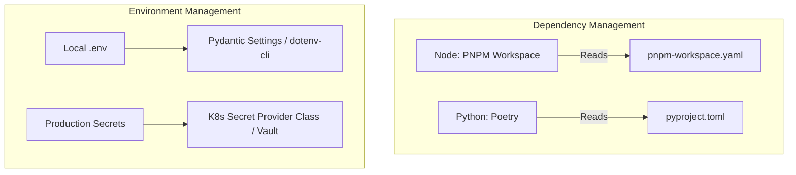
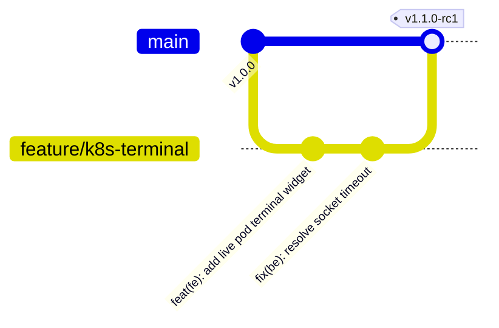

# OpsPilot AI: Phase 2 Enterprise Monorepo Blueprint & Repository Foundation

This document defines the complete directory hierarchy, module breakdown, and engineering standards for the **OpsPilot AI** enterprise monorepo. 

---

## 1. Monorepo Directory Hierarchy Visualization

```text
opspilot-ai/
├── .github/                       # GitHub Actions CI/CD workflows and actions
├── apps/                          # Deployable applications
│   ├── frontend/                  # Next.js 15 Frontend
│   ├── backend/                   # FastAPI Backend Core Service
│   └── ai-orchestrator/           # LangGraph AI Agents Engine
├── libs/                          # Shared libraries and packages
│   ├── mcp-core/                  # Shared Model Context Protocol helper SDK
│   ├── shared-types/              # Common schema types (JSON Schema/TypeScript)
│   └── telemetry-lib/             # Distributed tracking and OpenTelemetry setup
├── infrastructure/                # Platform orchestration files
│   ├── docker/                    # Dockerfiles for development and production
│   ├── compose/                   # Multi-container docker-compose configurations
│   ├── helm/                      # Kubernetes Helm charts for services
│   ├── terraform/                 # Infrastructure as Code templates
│   │   ├── modules/               # Shared IaC modules (eks, gke, rds, redis)
│   │   └── environments/          # Staging, production configurations
│   ├── nginx/                     # Gateway configuration files
│   └── k8s-manifests/             # Static Kubernetes YAML files
├── testing/                       # Quality assurance suite
│   ├── unit/                      # Cross-repo unit tests
│   ├── integration/               # Multi-component integration tests
│   ├── api/                       # API contract tests (Postman/Schemathesis)
│   ├── frontend/                  # E2E frontend tests (Playwright)
│   ├── load/                      # Traffic simulation scripts (k6)
│   └── security/                  # Static analysis configurations (Trivy/Checkov)
├── docs/                          # Knowledge base
│   ├── architecture/              # Diagrams and Architecture Decision Records (ADRs)
│   ├── api/                       # OpenAPI specifications and schema designs
│   ├── deployment/                # Production rollout guidelines
│   ├── contributing/              # Contributor guidelines
│   ├── developer-guide/           # Quickstart and environment setup
│   ├── security/                  # Encryption guidelines and key policies
│   └── runbooks/                  # SRE troubleshooting operations
├── .gitignore
├── pnpm-workspace.yaml            # PNPM monorepo workspace definition
├── pyproject.toml                 # Backend Python package configurations
└── README.md
```

---

## 2. Directory Breakdown & Responsibility Mapping

### 2.1 Apps Tier (`/apps`)

#### A. Frontend: Next.js 15 Client (`/apps/frontend/`)
* **Purpose**: Hosts the user-facing web dashboard.
* **Responsibility**: Interface rendering, state syncing, telemetry collection.
* **Ownership**: Frontend Engineering Team.
* **Key Subdirectories & Typical Contents**:
  * **`src/app/` (App Router)**: Defines routing paths, page layouts, and server-side components.
    * *Contents*: `layout.tsx`, `page.tsx`, and route folders.
  * **`src/components/`**: Reusable presentation widgets.
    * *Contents*: Custom UI components like `Button.tsx`, `Card.tsx`, `Dropdown.tsx`.
  * **`src/features/`**: Code organized by product features to isolate domains.
    * **`auth/`**: Sign-in forms, multi-factor prompt boxes.
    * **`dashboard/`**: Operational stats panel.
    * **`monitoring/`**: Metric charts, incident lists.
    * **`deployments/`**: Target application logs, deploy state buttons.
    * **`kubernetes/`**: Interactive cluster terminal view, namespace filters.
    * **`pipelines/`**: Step execution logs, status grids.
    * **`ai-chat/`**: Conversational interface to interact with operations agents.
    * **`settings/`**: Organization profiles, API key provisioning tables.
  * **`src/hooks/`**: Custom React hooks.
    * *Contents*: `useAuth.ts`, `useLiveLogs.ts`, `usePodStatus.ts`.
  * **`src/contexts/`**: Shared state React context files.
    * *Contents*: `ThemeContext.tsx`, `TelemetryContext.tsx`.
  * **`src/services/`**: Operations services handling client transactions.
    * *Contents*: `k8sService.ts`, `pipelineService.ts`.
  * **`src/api/`**: Axios/Fetch clients with built-in retry and interceptor logic.
    * *Contents*: `apiClient.ts`, `endpoints.ts`.
  * **`src/stores/`**: Zustand application store instances.
    * *Contents*: `authStore.ts`, `clusterStore.ts`.
  * **`src/types/`**: TypeScript interfaces and types.
    * *Contents*: `api.d.ts`, `user.d.ts`.
  * **`src/utils/`**: Shared client-side helper functions.
    * *Contents*: `formatBytes.ts`, `dateHelpers.ts`.
  * **`src/assets/`**: Static image files and stylesheets.
    * *Contents*: Logo files, font definitions, and standard CSS settings.
  * **`src/layouts/`**: Layout containers (sidebars, standard headers).
    * *Contents*: `SidebarLayout.tsx`, `CenteredLayout.tsx`.
  * **`src/providers/`**: Context state provider wrappers.
    * *Contents*: `QueryProvider.tsx`, `ThemeProvider.tsx`.

#### B. Backend: Core Service (`/apps/backend/`)
* **Purpose**: Coordinates transaction processing, databases, user profiles, and environment configurations.
* **Responsibility**: Provides the REST API, executes database operations, and manages queues.
* **Ownership**: Core Backend Engineering Team.
* **Key Subdirectories & Typical Contents**:
  * **`src/core/`**: Initialization code, custom exceptions, and authorization parameters.
    * *Contents*: `exceptions.py`, `security.py`.
  * **`src/config/`**: Configuration management system using Pydantic Settings.
    * *Contents*: `settings.py` (reads `.env` data).
  * **`src/database/`**: Alembic database migrations and session pool configurations.
    * *Contents*: `connection.py`, migrations directory.
  * **`src/models/`**: SQLModel / SQLAlchemy database models.
    * *Contents*: `user.py`, `incident.py`, `cluster.py`.
  * **`src/schemas/`**: Pydantic schemas for request validation and API responses.
    * *Contents*: `request_validators.py`, `response_models.py`.
  * **`src/repositories/`**: Database access objects implementing CRUD patterns.
    * *Contents*: `user_repository.py`, `incident_repository.py`.
  * **`src/services/`**: Business logic modules.
    * **`deployment_engine/`**: Handles rollouts and coordinates Helm executions.
    * **`kubernetes/`**: Syncs container configurations and parses cluster outputs.
    * **`git_integration/`**: Handles Git checkout flows and webhook verification.
    * **`pipeline_engine/`**: Manages pipeline stages, logs, and triggers.
    * **`incident_management/`**: Processes incoming alarms and groups alerts.
    * **`notifications/`**: Formats messages and manages Slack/PagerDuty webhooks.
  * **`src/dependencies/`**: FastAPI route injection parameters.
    * *Contents*: `get_db.py`, `current_user.py`.
  * **`src/middleware/`**: Request preprocessing filters.
    * *Contents*: `rate_limiter.py`, `audit_logger.py`, `cors.py`.
  * **`src/routers/`**: FastAPI route handlers grouped by resource domain.
    * *Contents*: `auth_router.py`, `cluster_router.py`, `deploy_router.py`.
  * **`src/workers/`**: Celery worker application configuration.
    * *Contents*: `celery_app.py`.
  * **`src/tasks/`**: Ephemeral backend tasks.
    * *Contents*: `deployment_tasks.py`, `sync_tasks.py`.
  * **`src/events/`**: Internal event dispatch routing.
    * *Contents*: `handlers.py`.
  * **`src/observability/`**: OpenTelemetry trace instrumentation.
    * *Contents*: `tracer.py`.

#### C. AI Engine: Intelligent Orchestrator (`/apps/ai-orchestrator/`)
* **Purpose**: Executes operational diagnostics and orchestrates multi-agent tasks.
* **Responsibility**: LangGraph execution loops, prompt management, vector searches, and tool invocations.
* **Ownership**: AI Systems Architect Team.
* **Key Subdirectories & Typical Contents**:
  * **`src/langgraph/`**: Cyclic graph workflow configurations.
    * *Contents*: `supervisor_graph.py`, `state.py`.
  * **`src/agents/`**: Specialized agent implementations.
    * *Contents*: `k8s_agent.py`, `rca_agent.py`, `cost_agent.py`.
  * **`src/prompts/`**: Multi-agent instruction templates.
    * *Contents*: `diagnose_crash.prompt`, `system_instructions.yaml`.
  * **`src/memory/`**: Short-term state and session history caches.
    * *Contents*: `redis_memory_store.py`.
  * **`src/tools/`**: Execution actions exposed to agents via the Model Context Protocol (MCP).
    * *Contents*: `k8s_tools.py`, `loki_tools.py`, `terraform_tools.py`.
  * **`src/chains/`**: Linear LLM chains for quick classifications.
    * *Contents*: `log_parser.py`, `severity_classifier.py`.
  * **`src/evaluators/`**: Automated diagnostic tests to evaluate prompt performance.
    * *Contents*: `rag_accuracy.py`.
  * **`src/embeddings/`**: Vector embedding generation logic.
    * *Contents*: `openai_embeddings.py`.
  * **`src/vector_store/`**: Qdrant vector database interfaces.
    * *Contents*: `client.py`, `queries.py`.
  * **`src/knowledge_base/`**: RAG reference files, runbooks, and indexes.
    * *Contents*: `troubleshooting_indices.json`.

---

### 2.2 Shared Libraries (`/libs`)

* **`mcp-core/`**: Helper methods and SDK configuration templates for developing new MCP tools.
* **`shared-types/`**: Shared data schemas used to synchronize structures between Node.js and Python.
* **`telemetry-lib/`**: Unified configuration settings for log formats, trace sampling, and metrics export.

---

### 2.3 Infrastructure as Code (`/infrastructure`)

* **`docker/`**: Dev and production build files.
  * *Contents*: `frontend.Dockerfile`, `backend.Dockerfile`.
* **`compose/`**: Multi-container runtime definitions.
  * *Contents*: `docker-compose.yml`, `docker-compose.override.yml`.
* **`helm/`**: Kubernetes package templates.
  * *Contents*: Chart directories for `opspilot-core` and `opspilot-ai`.
* **`terraform/`**: Infrastructure as Code modules.
  * *Contents*: `main.tf`, `variables.tf`, modules for RDS, EKS, and VPC configuration.
* **`nginx/`**: Reverse proxy gateway configuration.
  * *Contents*: `nginx.conf`, route definitions.
* **`k8s-manifests/`**: Static manifest configurations.
  * *Contents*: `namespaces.yaml`, pod network policies.

---

### 2.4 Testing (`/testing`)

* **`unit/`**: Isolated unit tests.
* **`integration/`**: Integration tests verifying database and API connections.
* **`api/`**: OpenAPI integration testing scripts.
* **`frontend/`**: End-to-end user flow validation tests using Playwright.
* **`load/`**: Scaling tests simulating peak API requests using k6.
* **`security/`**: Dependency vulnerability scans and infrastructure validation configurations.

---

### 2.5 Documentation (`/docs`)

* **`architecture/`**: System design reviews and architectural decision records.
* **`api/`**: Swagger schema mappings.
* **`deployment/`**: Installation guides.
* **`contributing/`**: Development environment setup guidelines.
* **`developer-guide/`**: Walkthroughs for core modules.
* **`security/`**: Key rotation guidelines and access control policies.
* **`runbooks/`**: Troubleshooting guides for handling common system alert patterns.

---

## 3. Engineering Standards & Governance

To maintain a clean and scalable codebase as the platform grows, all development must adhere to the following monorepo governance standards.

### 3.1 Naming Conventions

* **Directory Names**: Lowercase with hyphens (e.g., `ai-orchestrator`, `shared-types`).
* **Python Components (Backend / AI)**:
  * Directories: `snake_case` (e.g., `vector_store`).
  * Class names: `PascalCase` (e.g., `KubernetesAgent`, `UserRepository`).
  * Functions and variables: `snake_case` (e.g., `get_deployment_status`).
  * File suffix mappings: `*_router.py`, `*_repository.py`, `*_tasks.py`.
* **TypeScript Components (Frontend)**:
  * React UI components: `PascalCase` (e.g., `MetricsChart.tsx`, `ActionButton.tsx`).
  * Utility functions and hooks: `camelCase` (e.g., `useLiveLogs.ts`, `formatBytes.ts`).
  * Types: `PascalCase` (e.g., `DeployStatus`, `UserMetadata`).

### 3.2 Dependency & Environment Management



* **Node.js (Frontend / Shared Types)**:
  * Use **PNPM Workspaces** to deduplicate dependencies, speed up installation, and share types.
  * Dependency lockfile: `pnpm-lock.yaml`.
* **Python (Backend / AI Engine)**:
  * Managed via **Poetry** with group dependency definitions (`pyproject.toml`).
  * Production lockfile: `poetry.lock`.
* **Environment Variables**:
  * Never commit API keys or production secrets to Git.
  * Local configurations are managed through `.env.template` files. Application services read these variables using Pydantic Settings or `dotenv` loaders.

### 3.3 Secrets Management
* **Development**: Encrypted local development variables are decrypted at launch using `dotenv-cli` or AWS SSM credentials in the developer's session.
* **Production**: Kubernetes deployments use the External Secrets Operator to mount secrets directly from AWS Secrets Manager or HashiCorp Vault. These are injected into containers as environment variables or mounted files, avoiding plain-text exposure in configuration repositories.

### 3.4 Versioning Strategy
* The repository uses **Semantic Versioning 2.0.0** (`MAJOR.MINOR.PATCH`).
* **Monorepo Versioning**:
  * **Independent Versioning**: Shared libraries (`/libs`) are versioned independently and published to a private registry (e.g., private npm or PyPI) to prevent breaking changes across applications.
  * **Unified Versioning**: Client applications and API packages share a unified version tag (e.g., `v1.2.0`) to coordinate releases.

### 3.5 Git Branching & Commit Conventions



* **Branching Strategy**:
  * Adheres to **Trunk-Based Development**.
  * Developer branches use clear prefix structures:
    * `feature/*` (e.g., `feature/k8s-terminal-logs`)
    * `bugfix/*` (e.g., `bugfix/redis-lock-expiry`)
    * `chore/*` (e.g., `chore/bump-poetry-packages`)
  * Feature branches are short-lived (merged into `main` within 48 hours).
* **Commit Guidelines**:
  * Commits must follow **Conventional Commits**:
    * `feat(scope): short description`
    * `fix(scope): short description`
    * `docs(scope): short description`
  * Examples: `feat(fe): add live pod terminal widget`, `fix(be): resolve Celery task serialization error`.

### 3.6 Release Workflows
* **Continuous Integration**: Every pull request triggers GitHub Actions workflows that run style linters (Black/ESLint), TypeScript type checks, and unit tests.
* **Continuous Delivery**: Merges to `main` trigger a staging rollout. Successful staging runs generate a draft GitHub release with changelogs parsed from conventional commits.
* **Deployment Promotion**: Tagging a release (e.g., `v1.5.0`) triggers a GitHub Actions release pipeline. This pipeline builds, tags, and pushes production Docker images to the registry, then rolls out the new version to the target Kubernetes cluster.
